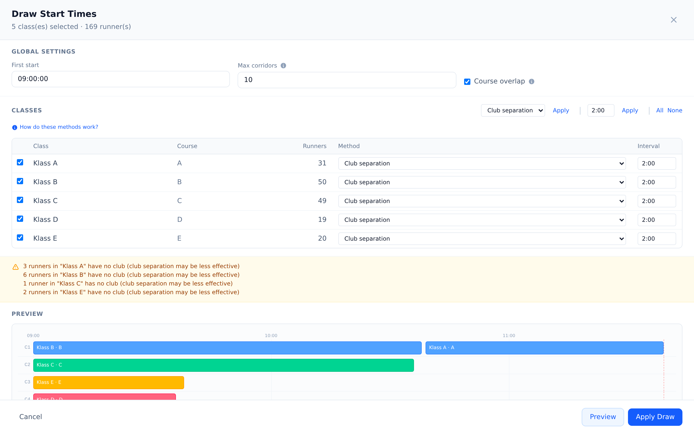
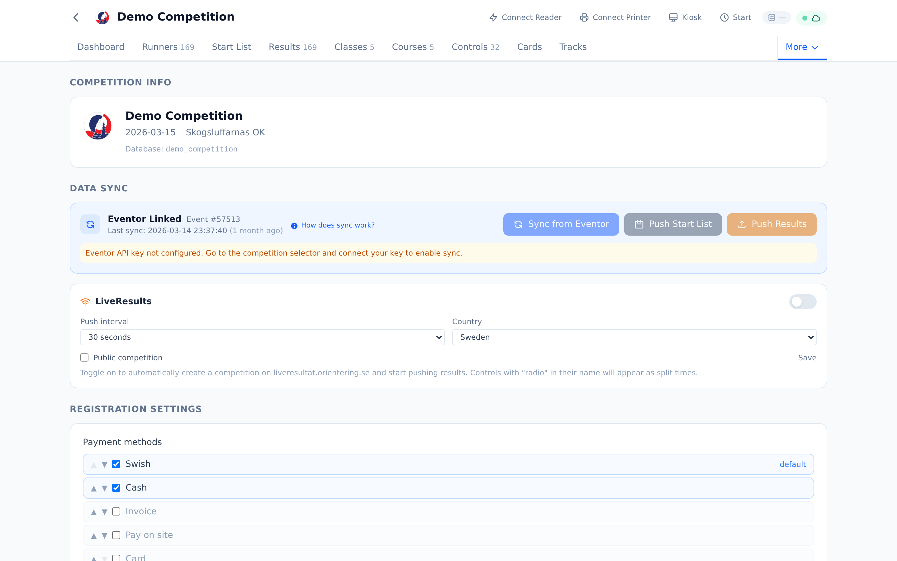
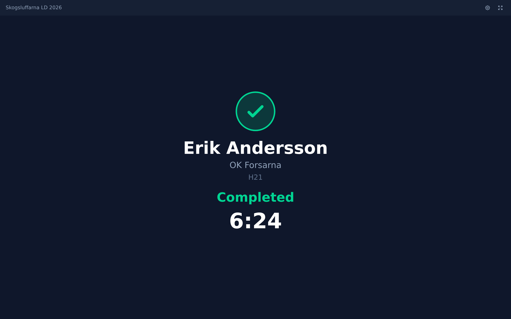

# Technical Architecture

Oxygen is a modern web application for managing orienteering competitions. It covers the full lifecycle — from entry management and course setup through start draw, SI card readout, and live results.

## System Overview

```
+------------------------------------------------------+
|                      Browser                         |
|  +-----------+  +----------+  +-----------------+    |
|  | React PWA |  |  Kiosk   |  |  Start Screen   |    |
|  | (Admin)   |  |  (Dark)  |  |  (Call-up)      |    |
|  +-----+-----+  +----+-----+  +--------+--------+    |
|        |  BroadcastChannel    |        |             |
|        |<---------------------+        |             |
|        +-----------+-----------+-------+             |
|                    | tRPC (HTTP batch)               |
+--------------------+---------------------------------+
                     |
+--------------------v---------------------------------+
|  Fastify API                                         |
|  +------------------------------------------------+  |
|  | tRPC Router (type-safe, Zod-validated)         |  |
|  |  competition  runner  draw     testLab         |  |
|  |  cardReadout  course  class    eventor         |  |
|  |  liveresults  club    race     control         |  |
|  +------------------------+-----------------------+  |
|                           | Prisma ORM               |
+---------------------------+--------------------------+
                            |
+---------------------------v--------------------------+
|  MySQL 8                                             |
|  +---------------------------+ +------------------+  |
|  | MeOSMain                  | | <competition_db> |  |
|  | - oEvent (registry)       | | - oRunner        |  |
|  | - oxygen_runner_db        | | - oClass         |  |
|  | - oxygen_club_db          | | - oCourse        |  |
|  |                           | | - oControl       |  |
|  |                           | | - oCard          |  |
|  |                           | | - oPunch         |  |
|  +---------------------------+ +------------------+  |
+------------------------------------------------------+
```

## Tech Stack

| Layer | Technology | Why |
|-------|-----------|-----|
| **Frontend** | React 19, Vite, Tailwind CSS v4 | Modern component model, instant HMR, utility-first CSS with zero runtime |
| **Routing** | React Router v7 | Nested routes with URL-driven state |
| **Data fetching** | TanStack Query + tRPC React | Automatic caching, stale-while-revalidate, end-to-end type safety |
| **Backend** | Fastify 5 + tRPC 11 | High-performance HTTP, type-safe RPC with zero code generation |
| **Validation** | Zod 4 | Runtime schema validation shared between client and server |
| **ORM** | Prisma 6 | Type-safe database access with migration support |
| **Database** | MySQL 8 | MeOS-compatible schema — both tools can operate on the same database |
| **Testing** | Vitest (unit), Playwright (E2E) | Fast unit tests, reliable browser automation |
| **Build** | Docker multi-stage | Reproducible builds, separate API and web containers |

## Database Architecture

Oxygen uses MySQL with a two-tier database design:

**MeOSMain** — a shared registry database containing:
- `oEvent` — competition registry (one row per competition, with `NameId` as the database name)
- `oxygen_runner_db` — global runner database synced from Eventor
- `oxygen_club_db` — global club/organization database with logos

**Per-competition databases** — each competition gets its own MySQL database with the MeOS schema:
- `oRunner`, `oClass`, `oCourse`, `oControl`, `oCard`, `oPunch`, `oClub`, `oTeam`, `oEvent`
- `oCounter` — change counter for detecting external modifications (MeOS compatibility)
- `oMonitor` — heartbeat table for client presence detection

This design means Oxygen and MeOS can operate on the same database simultaneously. The `oCounter` table is used for change detection, so edits made in MeOS are immediately reflected in Oxygen and vice versa.

**Future direction:** Once Oxygen is mature enough to stand on its own without MeOS compatibility, the plan is to migrate from MySQL to PostgreSQL. This will unlock features like better JSON support, advanced indexing, and simpler hosting options while shedding the constraints of the legacy MeOS schema.

## Deployment Options

### Docker (full stack)
```bash
docker compose up -d        # MySQL + API + Web
```
Starts MySQL 8, the API server, and an Nginx-served web frontend. Suitable for dedicated servers or cloud VMs.

### Docker (host database)
```bash
docker compose -f docker-compose.host-db.yml up --build -d
```
Connects to an existing MySQL instance on the host. Useful when running alongside a local MeOS installation.

### Bare metal
```bash
pnpm install && pnpm db:generate && pnpm dev
```
Node.js 20+, pnpm 10+, and a MySQL 8 instance. The API proxies through Vite in development.

### Cloud Shell demo
One-click deployment via Google Cloud Shell — no local install needed. See [demo.md](demo.md).

## Offline / Local-First Vision

Oxygen is designed for field conditions where internet connectivity is unreliable. The database is always hosted remotely (cloud VM or dedicated server), keeping the competition data safe and accessible from anywhere. The planned approach makes each client station resilient to connectivity loss:

- **Service Worker caching** — cache the full PWA shell and API responses so Oxygen loads and operates without internet
- **Remote database, local resilience** — MySQL runs on a remote server; each Oxygen PWA client caches all data it needs to continue operating independently during an outage
- **Local network fallback** — during internet loss, Oxygen stations on the same local network (e.g., registration and start) can propagate new registrations and card readouts directly between each other
- **Background sync** — when connectivity is restored, queued changes sync back to the remote database, Eventor, and LiveResults
- **SI card readout** — Web Serial API works entirely locally, no network needed

This means the remote database is the source of truth, but each client can survive disconnection. The only challenge is propagating new registrations between stations during an outage, which is solvable via local network discovery when stations share a WiFi network.

## Key Subsystems

### Draw Engine
The start draw algorithm (`packages/api/src/draw/`) supports multiple methods:
- **Club separation** — ensures runners from the same club don't start consecutively
- **Random** — simple random allocation
- **Seeded** — preserves a specific order
- **Simultaneous** — mass start

The draw uses corridor assignment (parallel start lanes) and accounts for course overlap — classes sharing a first control are separated in time. A graphical timeline visualization shows the draw result.



### SI Card Readout
SportIdent card reading uses the Web Serial API for direct hardware communication:
- Supports SI5, SI6, SI8, SI9, SI10, SI11, SIAC, pCard, and tCard
- Protocol implementation in `packages/web/src/lib/si-protocol.ts`
- Punch validation against course definition with automatic result computation
- Card write capability for owner data

### Control Management — Logical vs Physical Units

Oxygen distinguishes **logical controls** (the `oControl` MeOS table — what courses reference) from **physical units** (SI stations, identified by hardware serial). A logical control can own multiple physical units:

- **Redundancy** — two units at the same location punching the same code (radio + backup, or crowd management at spectator controls)
- **Replacement** — a broken unit swapped mid-race with a spare programmed to a different code; both codes live in `oControl.Numbers` (semicolon-separated), and the read path accepts either

Per-unit state (battery voltage, `checked_at`, last-programmed code, firmware) lives in `oxygen_control_units`, keyed by `station_serial`. The logical-control config (`radio_type`, `air_plus` override) stays in `oxygen_control_config`. Programming and backup-memory reads both upsert the corresponding unit row — so two units fulfilling the same logical control never overwrite each other's state. Forks, despite sometimes being described this way, are *not* modelled via multi-code in `Numbers`; they are separate logical controls with distinct codes and distinct courses.

### Eventor Integration
Direct integration with the Swedish Orienteering Federation's Eventor API:
- Import events, entries, classes, and clubs
- Sync global runner database for name/card lookup
- Upload results and start lists (Test-Eventor supported, production pending)



### Kiosk Mode
A self-service interface for race day:
- Registration — runners insert their SI card, admin enters details, card confirms
- Pre-start — shows course info and countdown to start time
- Readout — displays result (OK/MP/DNF) with running time

Communication between the admin window and kiosk uses the BroadcastChannel API, allowing them to run on the same machine without network dependency.



### Test Lab
Built-in data generation and race simulation for development and demo purposes:
- Generates realistic class structures, courses, and controls
- Populates with GDPR-safe fictional runners (randomized Swedish names, mixed SI card types)
- Simulates a full race with realistic split times and anomalies (DNF, mispunch, DNS)
- Supports instant or real-time simulation speeds

## Automated Documentation Screenshots

Screenshots in this directory are auto-generated. To regenerate after UI changes:

```bash
pnpm dev                # start dev servers
pnpm docs:screenshots   # capture all screenshots
```

The capture script (`docs/screenshots/capture.ts`) creates a temporary competition with fictional data, runs a draw and simulation, then captures screenshots of every major view. See [features.md](features.md) for the full screenshot gallery.
