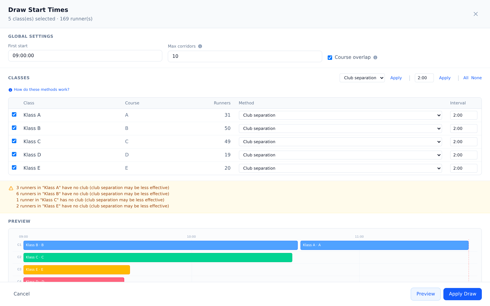
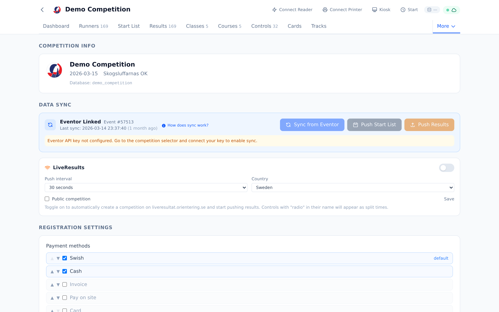
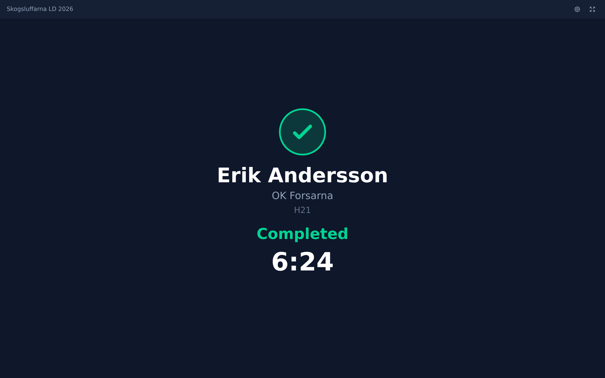

# Technical Architecture

Oxygen is a modern web application for managing orienteering competitions. It covers the full lifecycle — from entry management and course setup through start draw, SI card readout, and live results.

## System Overview

```
+------------------------------------------------------+
|                      Browser                         |
|  +-----------+  +----------+  +-----------------+    |
|  | React PWA |  |  Kiosk   |  |  Start Screen   |    |
|  | (Admin)   |  |  (Dark)  |  |  (Call-up)      |    |
|  +-----+-----+  +----+-----+  +--------+--------+    |
|        |  BroadcastChannel    |        |             |
|        |<---------------------+        |             |
|        +-----------+-----------+-------+             |
|                    | tRPC (HTTP batch)               |
+--------------------+---------------------------------+
                     |
+--------------------v---------------------------------+
|  Fastify API                                         |
|  +------------------------------------------------+  |
|  | tRPC Router (type-safe, Zod-validated)         |  |
|  |  event        runner  draw     testLab         |  |
|  |  cardReadout  course  class    eventor         |  |
|  |  liveresults  club    race     control         |  |
|  |  onlineInput  tracks  events                   |  |
|  +------------------------+-----------------------+  |
|                           | Prisma ORM               |
+---------------------------+--------------------------+
                            |
+---------------------------v--------------------------+
|  PostgreSQL 18 — single database `oxygen`            |
|                                                      |
|  schema `oxygen`:                                    |
|    events, controls, courses, course_controls,       |
|    classes, class_course_pools, runners, teams,      |
|    cards, card_readouts, punches, control_units,     |
|    event_log, event_seqs, map_files, rendered_maps,  |
|    map_tiles, tracks, routes, users                  |
|                                                      |
|  global directories (schema `oxygen`):               |
|    runner_directory, club_directory,                 |
|    eventor_event_meta, oxygen_settings, users        |
|                                                      |
|  PK strategy:                                        |
|    UUIDv7 (client-mintable) + per-event `seq INT`    |
|    (URL-stable, allocated by BEFORE INSERT trigger)  |
+------------------------------------------------------+
```

## Tech Stack

| Layer | Technology | Why |
|-------|-----------|-----|
| **Frontend** | React 19, Vite 8, Tailwind CSS v4 | Modern component model, instant HMR, utility-first CSS with zero runtime |
| **Routing** | React Router v7 | Nested routes with URL-driven state |
| **Data fetching** | TanStack Query + tRPC React | Automatic caching, stale-while-revalidate, end-to-end type safety |
| **Backend** | Fastify 5 + tRPC 11 | High-performance HTTP, type-safe RPC with zero code generation |
| **Validation** | Zod 4 | Runtime schema validation shared between client and server |
| **ORM** | Prisma 7 (`prisma-client` generator + `@prisma/adapter-pg`) | Type-safe database access with migration support |
| **Database** | PostgreSQL 18 | UUIDv7 PKs, JSONB columns, native ENUM types, row-level FKs |
| **Testing** | Vitest 4 (unit), Playwright 1.62 (E2E) | Fast unit tests, reliable browser automation |
| **Build** | Docker multi-stage | Reproducible builds, separate API and web containers |

## Database Architecture

Oxygen runs on **a single PostgreSQL 18 database**. Every table lives in the
`oxygen` schema; the Prisma datasource is pointed at
`postgresql://…/oxygen?schema=oxygen`. The MeOS-compatible MySQL layout
(multi-database, per-event `oRunner` / `oCard` / `oPunch` tables, `oCounter`
change detection) was retired in the May 2026 refactor — see
[`docs/migrations/2026-drop-meos.md`](migrations/2026-drop-meos.md) for the
full migration story.

### Table groups

- **Event-scoped entities** — `controls`, `courses`, `course_controls`,
  `classes`, `class_course_pools`, `runners`, `teams`, `cards`,
  `control_units`. Each row has `id UUID PRIMARY KEY DEFAULT uuidv7()` plus
  a per-event `seq INT` (URL-stable, human-friendly). `seq` is allocated by
  a `BEFORE INSERT` trigger drawing from a shared
  `oxygen.event_seqs(event_id, table_name, next_seq)` table, so explicit
  values can be passed through (the migration tool relies on this).
- **Append-only / immutable** — `card_readouts`, `punches`, `event_log`.
  UUID PK only, no `seq`. The offline-first work renames `event_log` →
  `journal` and adds `hlc` / `actor_id` / `schema_version` — see
  [`offline-architecture.md`](offline-architecture.md).
- **Pure server-side** — `map_files`, `rendered_maps`, `map_tiles`,
  `tracks`, `routes`. `BIGSERIAL` PK.
- **Global directories** — `runner_directory`, `club_directory`,
  `eventor_event_meta`, `users`. Eventor directories are keyed by their
  natural external IDs; `users` is invite-only email identity (see
  [authentication.md](authentication.md)).
- **Settings** — `oxygen_settings` (Eventor API keys, runner-db revision,
  etc.); a flat key/value store shared by all events.

### ID strategy

Hybrid: `id UUID` (client-mintable, offline-safe, eventually-consistent
sync-friendly) + per-event `seq INT` (used in URLs like
`/Bagissprinten/runners?runner=196`). The API speaks `seq` on the wire for
human-facing entities; internally everything joins on UUIDs.

### Status semantics

`runners.status` and `controls.status` use native PostgreSQL ENUM types
(`runner_status`, `control_status`). The API converts to/from the legacy
integer codes at the boundary via `statusConvert.ts` so existing clients
keep working during the transition.

### Time storage

All times live in **ZeroTime-relative deciseconds** (the column type is
`INT`, default `0`). The default `ZeroTime` is `324000` (09:00:00 in
deciseconds since midnight). Every API surface accepts **absolute
deciseconds** and converts at the boundary (`toAbsolute` / `toRelative` in
`packages/api/src/timeConvert.ts`).

## Deployment Options

### Docker (full stack)
```bash
docker compose up -d        # PostgreSQL + API + Web
```
Starts PostgreSQL 18, the API server, and an Nginx-served web frontend. Suitable for dedicated servers or cloud VMs.

### Docker (host database)
```bash
docker compose -f docker-compose.host-db.yml up --build -d
```
Connects to an existing PostgreSQL 18 instance on the host (`localhost:5432`). Convenient when running alongside an integration test container or sharing a database across dev tools.

### Bare metal
```bash
pnpm install && pnpm db:generate && pnpm dev
```
Node.js 20+, pnpm 10+, and a PostgreSQL 18 instance. The API proxies through Vite in development.

### Cloud Shell demo
One-click deployment via Google Cloud Shell — no local install needed. See [demo.md](demo.md).

### GCP production (Cloud Run + Cloud SQL + IAP)
Club-facing hosted deployment: a single-container image (Docker target `cloud`, the API serving the web bundle via `WEB_DIST_DIR`) on Cloud Run behind Identity-Aware Proxy, backed by Cloud SQL. Scales to zero between competitions. See [deploy-gcp-cloud-run.md](deploy-gcp-cloud-run.md).

## Offline / Local-First Vision

Oxygen is designed for field conditions where internet connectivity is unreliable. The database is always hosted remotely (cloud VM or dedicated server), keeping the competition data safe and accessible from anywhere. The planned approach makes each client station resilient to connectivity loss:

- **Service Worker caching** — cache the full PWA shell and API responses so Oxygen loads and operates without internet
- **Remote database, local resilience** — PostgreSQL runs on a remote server; each Oxygen PWA client caches all data it needs to continue operating independently during an outage
- **Local network fallback** — during internet loss, Oxygen stations on the same local network (e.g., registration and start) can propagate new registrations and card readouts directly between each other
- **Background sync** — when connectivity is restored, queued changes sync back to the remote database, Eventor, LiveResults, and online-input (ROC). UUIDv7 PKs let offline-minted rows merge without ID collisions when they reach the server.
- **SI card readout** — Web Serial API works entirely locally, no network needed

This means the remote database is the source of truth, but each client can survive disconnection. The only challenge is propagating new registrations between stations during an outage, which is solvable via local network discovery when stations share a WiFi network.

## Key Subsystems

### Draw Engine
The start draw algorithm (`packages/api/src/draw/`) supports multiple methods:
- **Club separation** — ensures runners from the same club don't start consecutively
- **Random** — simple random allocation
- **Seeded** — preserves a specific order
- **Simultaneous** — mass start

The draw uses corridor assignment (parallel start lanes). Classes on the same course are grouped into one corridor and run sequentially; everything else may run in parallel.

Within a corridor a class occupies the span from its first start to the end of its last runner's slot (`lastStart + interval`, widened to at least `baseInterval`), so the next class starts exactly when the previous window closes. Corridors can be phase-shifted against each other via `DrawSettings.staggerOffset` — corridor *k* is shifted by `k * staggerOffset` wrapped within the interval, which spreads parallel lanes across the minutes of the interval. `ClassDrawConfig.startOffset` overrides that phase for a single class.

Terrain conflicts are handled as a spacing constraint rather than a grouping one. The scheduler books every start time against the course's first control and delays a class until all of its starts sit at least `DrawSettings.minFirstControlGap` (default 600 ds = 1 min, gated by `detectCourseOverlap`) away from the starts already booked on that control. Two classes on a 2-minute interval sharing control 31 therefore interleave onto alternating minutes instead of one blocking the other; a third class on the same control is pushed past the saturated window. A mass start (`simultaneous`) counts as a single instant at the control regardless of field size. A graphical timeline visualization (`packages/web/src/lib/draw-timeline.ts` → `DrawTimeline`) shows the draw result.



### SI Card Readout
SportIdent card reading uses the Web Serial API for direct hardware communication:
- Supports SI5, SI6, SI8, SI9, SI10, SI11, SIAC, pCard, and tCard
- Protocol implementation in `packages/web/src/lib/si-protocol.ts`
- Punch validation against course definition with automatic result computation
- Card write capability for owner data

### Control Management — Logical vs Physical Units

Oxygen distinguishes **logical controls** (`controls` — what courses reference) from **physical units** (SI stations, identified by hardware serial). A logical control can own multiple physical units:

- **Redundancy** — two units at the same location punching the same code (radio + backup, or crowd management at spectator controls)
- **Replacement** — a broken unit swapped mid-race with a spare programmed to a different code; both codes live in `controls.codes` (semicolon-separated), and the read path accepts either

Per-unit state (battery voltage, `checked_at`, last-programmed code, firmware) lives in `control_units`, keyed by `station_serial`. The logical-control config (`radio_type`, `air_plus` override) stays on the `controls` row itself. Programming and backup-memory reads both upsert the corresponding unit row — so two units fulfilling the same logical control never overwrite each other's state. Forks, despite sometimes being described this way, are *not* modelled via multi-code in `codes`; they are separate logical controls with distinct codes and distinct courses.

### Eventor Integration
Direct integration with the Swedish Orienteering Federation's Eventor API:
- Import events, entries, classes, and clubs
- Sync global runner database for name/card lookup
- Upload results and start lists (Test-Eventor and production)



### Online Input (ROC)
Per-event pull from a remote radio-control service. Currently supports the ROC protocol used by [roc.olresultat.se](https://roc.olresultat.se) (and OResults' compatible endpoint). One `setInterval` timer per event runs on the instance holding the background-jobs lease, polling the configured endpoint with a `lastId` watermark and inserting new rows into `punches` (with `source = 'online_input'`). The watermark advances in the same transaction as the inserts, and only if it still reads the value the poll started from, so a poller that raced another one rolls back rather than importing the same punches twice. Architecture and the SICenter forward-compat path are documented in [online-input-roc.md](online-input-roc.md). Code lives in `packages/api/src/online-input/` with a small `Protocol` interface so a second protocol (SICenter) is later a single new file plus a UI dropdown entry.

### Map tile rendering
Uploaded OCAD maps are served to the web viewer as slippy-map tiles. A tile request that misses the `map_tiles` cache rasterises a *window* — the region covered by a small block of tiles, expressed as a `viewBox` sub-rectangle of the map SVG — at a density derived from those tiles, then warps each tile out of it. Peak memory follows the block rather than the map, deep zoom stays sharp because the window is rendered denser than its tiles, and nothing in the path requires a single process: the cache is the `map_tiles` table and `/api/map-tile-progress` is computed from the database. See [map-tile-rendering.md](map-tile-rendering.md).

### Background jobs and horizontal scaling
Almost everything in the API scales out without coordination, because every request reads and writes Postgres. The exceptions are the timers that are not driven by a request and have effects outside the database: the LiveResults push, ROC polling, and journal shipping. Running any of them twice means duplicate pushes or duplicate punches, so exactly one instance runs them at a time, chosen by a renewable lease row in `oxygen.instance_lease`. The holder reconciles its timers against the per-event configuration every few seconds, which is also how a change made on another instance takes effect. See [background-jobs-lease.md](background-jobs-lease.md).

### Kiosk Mode
A self-service interface for race day:
- Registration — runners insert their SI card, admin enters details, card confirms
- Pre-start — shows course info and countdown to start time
- Readout — displays result (OK/MP/DNF) with running time

Communication between the admin window and kiosk uses the BroadcastChannel API, allowing them to run on the same machine without network dependency.



### Admin shell navigation

`CompetitionShell` derives the tab bar from `competition.dashboard` `contentSignals` (`hasMap`, `hasClasses`, `hasCourses`, `hasRunners`, `hasResults`) intersected with the user's capabilities. Tabs that are not yet relevant collapse into More; tabs the user cannot access are omitted. While the dashboard query is still loading, the shell uses the previous always-on layout (still capability-filtered) so a mature event does not flash a planning-only bar. Layout rules live in `packages/web/src/lib/shell-tabs.ts`.

Identity (optional): see [authentication.md](authentication.md). With `AUTH_MODE=off` nothing changes. With `proxy`/`dev`, event-scoped tRPC requires an invited user plus a capability; kiosk and start screen stay renderable with a kiosk key (or a logged-in user who already has the matching capability).

### Test Lab
Built-in data generation and race simulation for development and demo purposes:
- Generates realistic class structures, courses, and controls
- Populates with GDPR-safe fictional runners (randomized Swedish names, mixed SI card types)
- Simulates a full race with realistic split times and anomalies (DNF, mispunch, DNS)
- Supports instant or real-time simulation speeds

## Automated Documentation Screenshots

Screenshots in this directory are auto-generated. To regenerate after UI changes:

```bash
pnpm dev                # start dev servers
pnpm docs:screenshots   # capture all screenshots
```

The capture script (`docs/screenshots/capture.ts`) creates a temporary competition with fictional data, runs a draw and simulation, then captures screenshots of every major view. See [features.md](features.md) for the full screenshot gallery.
