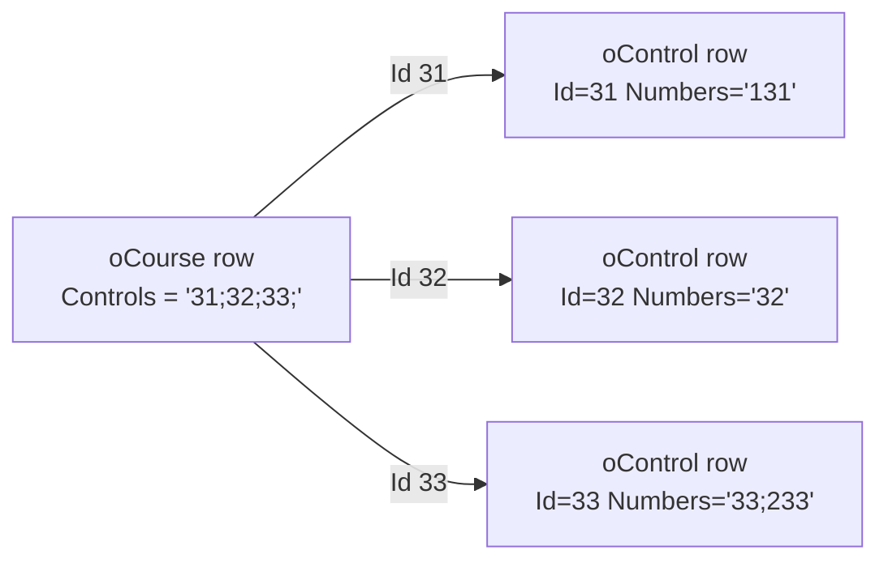
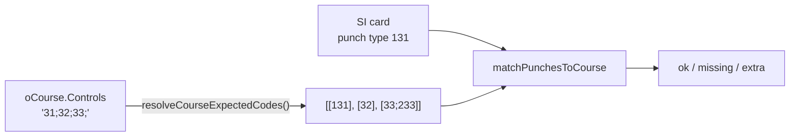

# Course Controls and Punch Matching

This document describes how Oxygen represents the control sequence on a
course, how it matches a runner's SI card punches against that sequence,
and how the two layers stay consistent when the user renumbers a control.

It is the authoritative reference for anyone touching `oCourse.Controls`,
`oControl.Numbers`, `parseCourseControlIds`, `resolveCourseExpectedCodes`,
or `matchPunchesToCourse`.

## TL;DR

- Each `oControl` row carries two distinct identifiers: a stable
  `Id` (primary key, used by every foreign-key-style reference) and a
  user-editable `Numbers` field with one or more SI punch codes.
- `oCourse.Controls` stores a semicolon-separated list of `oControl.Id`
  values. It never stores punch codes directly. This matches MeOS upstream
  exactly (`oCourse::getControls` in `code/oCourse.cpp:137`).
- All read paths that need punch codes — punch matching, the Courses
  page UI, structured-search filters, offline matching — dereference
  each `Id` to its current `oControl.Numbers` at read time.
- Renumbering a control on the Controls page is a single-row update on
  `oControl.Numbers`. Every consumer picks up the new code on the next
  read; nothing in `oCourse.Controls` (or anywhere else) needs to change.

## Two identifiers on a control

| Field | Type | Mutable? | Role |
|-------|------|----------|------|
| `oControl.Id` | `INT PRIMARY KEY` | No (after creation) | Stable handle. Used by `oCourse.Controls`, `oRunner.Course`, `oMonitor`, etc. |
| `oControl.Numbers` | `VARCHAR(128)` | Yes | One or more SI punch codes, semicolon-separated. Read by punch matching and by the UI when displaying "the code on the cards". |

By default a freshly-imported control has `Numbers[0] = Id`
numerically (`oControl.cpp:263` in MeOS, mirrored in Oxygen's IOF/OCD
import: `parseInt(controlCode)` becomes the new `Id` and a single-token
`Numbers` string). That convention is why most setups never notice the
distinction. As soon as someone renumbers a control via the Controls
page, `Id` and `Numbers` diverge and the dereference layer below earns
its keep.

### Multi-code controls

A single physical control may carry several SI codes — typical for
butterfly loops or shared SI stations. Set `Numbers = "131;231"` and
both codes become acceptable at any course position that references
this control's `Id`. The UI surfaces the first code (`Numbers[0]`) for
display; the matcher accepts every code in the list (mirrors MeOS
`oCourse.cpp:472,483`).

## Storage: `oCourse.Controls`



The semicolon-separated string in `oCourse.Controls` is **always** an
`oControl.Id` list. Start and finish controls are not included — they
live on dedicated columns / records. The trailing semicolon is part of
the MeOS storage convention and is preserved on writes.

This is verified against MeOS upstream:

- `code/oCourse.cpp:137`: `sprintf_s(bf, 16, "%d;", controls[m]->Id);`
  writes the Id list.
- `code/oCourse.cpp:253-264`: `importControls` parses ints and resolves
  each via `oe->getControl(Id, …)`.
- `code/MeosSQL.cpp:748`: `Controls` column is `VARCHAR(512)` matching
  Oxygen's Prisma schema.

## Read paths

All four read paths converge on the same dereference logic, exposed
through helpers in `packages/api/src/routers/course.ts`.

### 1. Punch matching



The matcher (`packages/shared/src/readout.ts`) takes
`expectedCodes: number[][]` — a per-position list of acceptable SI codes.
A single-code position is `[31]`; a multi-code position is `[131, 231]`;
mixing both shapes on one course is fine. Any punch whose `type` matches
any code in the position's set counts as a hit. Mirrors MeOS
`oCourse::distance` (`oCourse.cpp:472-501`).

A backward-compatible normaliser (`normalizeExpectedCodes`) accepts the
legacy `number[]` shape (one code per position) and lifts it to the new
shape, so old test fixtures and any non-resolver call sites keep working.

Server consumers — `cardReadout.performReadout`, `eventor.ts` split-time
upload, `runner.ts` placement — call `resolveCourseExpectedCodes(client,
course.Controls)` once per course and pass the resulting `number[][]`
to the matcher.

### 2. Offline matching

The PWA caches `competition.dashboard` for offline use. Each `CourseInfo`
in that response carries `expectedCodes: number[][]` already resolved
by the server, so the offline `local-readout.ts` can match without a
live database connection. The cache is invalidated by tRPC's
`utils.competition.dashboard.invalidate()` whenever a control's
`Numbers` changes, so reconnecting clients pick up the new codes
automatically.

### 3. Courses page (display)

`course.detail` returns

```ts
controlCodes: { id: number; code: string }[]
```

derived from `resolveCourseControlsToCodes`. Each entry pairs the stable
`Id` (used internally and on save) with the live `code` (first code per
multi-code control, used everywhere a human reads the value). The chip
strip and the editable text input both consume `code`; the user never
sees the underlying Id.

### 4. Courses page (save)

The text input on the Courses page is parsed into a `string[]` of
trimmed punch codes and sent through `course.update({ controlCodes })`.
The server runs `resolveCodesToCourseControls`, which:

1. Matches each token against any `oControl.Numbers` entry first
   (handles renumbered and multi-code controls without surprises).
2. Falls back to `oControl.Id` if the token is not a current punch
   code (lets power users paste an Id list, and lets the MeOS-default
   `Id == Numbers[0]` case work without ceremony).
3. Throws `TRPCError({ code: "BAD_REQUEST", message: "Unknown control
   codes: …" })` listing every unresolved token in one message, so the
   form can render a single, complete error.

The resolved Id list is written back to `oCourse.Controls` in MeOS's
`Id;Id;Id;` shape — storage stays MeOS-compatible regardless of what
the user typed.

`course.create` exposes the same `controlCodes` input for newly-created
courses and obeys the same translation rules.

### 5. Structured-search filter (`control:<code>`)

The runner-list endpoint flattens each course's per-position acceptable
code list into a single `number[]` and ships it as
`runner.courseControlCodes`. The `control:<code>` filter then searches
for runners whose course visits a given live punch code. Multi-code
controls contribute every acceptable code, so `control:131` and
`control:231` both match a runner whose course visits a control with
`Numbers="131;231"`.

## Editing workflows

### Renumbering a single control

1. User opens the Controls page, edits the punch code from `31` to
   `131`. The Controls UI calls `control.update({ id, codes: "131" })`,
   which writes only `Numbers` (`Id` is the primary key, untouched).
2. Every read path immediately sees the new code:
   - The Courses page shows `131` in the chip strip and in the editable
     text.
   - A new card readout matches `131` punches at the corresponding
     position.
   - The structured-search `control:131` filter returns runners whose
     course visits this control.
3. No other tables need to change. `oCourse.Controls` continues to
   reference the unchanged `Id`; results already in `oRunner` /
   `oCard` keep their existing punch records.

### Replacing a control on a single course

The Courses-page edit input lets the user replace one code with another
(e.g. `31;32;33` → `131;42;33` to swap the second control). The save
path:

1. Splits the input on `; , <whitespace>`.
2. Sends `controlCodes: ["131", "42", "33"]` to `course.update`.
3. Server resolves each code: `131 → oControl.Id 31` (existing renamed
   control), `42 → oControl.Id 42`, `33 → oControl.Id 33`. If `42` does
   not exist as a punch code or Id, the save is rejected with
   `BAD_REQUEST`.
4. New `oCourse.Controls = "31;42;33;"` (Id list) is written.

### Multi-code control on a course

Define the multi-code value on the Controls page once
(`Numbers = "131;231"`). On any course referencing this control, the
chip strip displays `131` (first code), and matching accepts either
code at the relevant position. Editing the course's text input back to
`131;…` keeps the multi-code definition intact (the resolver matches
`131` to the existing control by its first `Numbers` entry).

## Test coverage

| Layer | Location |
|-------|----------|
| Pure helpers (`parseCourseControlIds`, `normalizeExpectedCodes`) | `packages/api/src/__tests__/courseHelpers.test.ts` |
| Matcher (`matchPunchesToCourse`, including multi-code, renumbered) | `packages/api/src/__tests__/cardReadout.test.ts` |
| End-to-end renumber → detail → readout → save → unknown-code error | `packages/api/src/__tests__/integration/course-controls-renumber.test.ts` |
| Existing E2E flows (no Id↔Numbers divergence) | `e2e/courses.spec.ts`, `e2e/kiosk-readout.spec.ts`, `e2e/webserial.spec.ts` |

## Status semantics

Each `oControl` has a `Status` value (MeOS enum). The values that affect
matching and time accounting are documented below; the special-control
statuses `Start` / `Finish` / `Check` / `Clear` are control-station
roles, not match-time decisions, and live on dedicated start/finish
records that are not stored in `oCourse.Controls`.

| Status (value) | UI label (en/sv) | Match | Time | Use case |
|---|---|---|---|---|
| `OK` (0) | OK / OK | required, missing → MP | leg counts | the default. |
| `Bad` (1) | Bad / Trasig | skipped — missing is fine; if punched, time is recorded for splits | leg counts normally | reactive: control broke during the race. |
| `Multiple` (2) | Multiple / Multipel | expanded into N any-order positions sharing the same code pool | each leg counts | butterflies / forking clusters; the runner must hit all listed codes in any order. |
| `NoTiming` (7) | No Timing / Utan tidtagning | required, missing → MP | leg into it is **deducted** from running time | transit zones, mandatory transitions, water stations. |
| `Optional` (8) | Optional / Valfri | identical to Bad | leg counts normally | by-design optional positions, e.g. relay bonus controls. |
| `BadNoTiming` (9) | Bad (No Timing) / Försvunnen | skipped (like Bad) **and** the leg into the next required position is deducted | follow-on leg deducted | a control vanished mid-race and runners wasted time hunting. |

The matcher implementation lives in `matchPunchesToCourse`
(`packages/shared/src/readout.ts`) and accepts a per-position
`ExpectedPosition[]`:

```ts
export interface ExpectedPosition {
  codes: number[];      // SI punch codes acceptable at this position
  skipMatching: boolean;// true → missing does NOT count as MP
  noTimingLeg: boolean; // true → leg INTO this position deducted from running time
}
```

The resolver `resolveCourseExpectedPositions`
(`packages/api/src/routers/course.ts`) builds this shape from each
referenced `oControl`'s `Status` + `Numbers` and bakes in the special
behaviours:

- **Multiple expansion**: a single control with `Numbers="31;32;33"` and
  `Status=Multiple` becomes three positions, each accepting any of the
  three codes (`oCourse.cpp:467-477`).
- **BadNoTiming propagation**: the status emits a skipped position;
  when the next non-skipped position is emitted, its `noTimingLeg` is
  set so the leg from the last good control to that position is
  deducted (`oRunner.cpp:1772-1786`).

## Time accounting

`MatchResult.runningTimeAdjustment` carries the deciseconds to subtract
from the raw card duration:

```
canonicalRunningTime = max(0, finishTime - startTime - runningTimeAdjustment)
```

The adjustment is non-zero only when the runner traversed `NoTiming`
positions (or `BadNoTiming` positions whose follow-on leg got the
propagated `noTimingLeg=true`).

This canonical value is the running time everywhere in the system after
this PR:

- **Kiosk**: the big number on the kiosk uses the adjusted time. When
  `runningTimeAdjustment > 0` a small `raw 35:42` subtitle appears so
  the runner sees both numbers and understands why they differ.
- **Admin readout** (`PunchTable` consumed by `CardReadout` and
  `RunnerInlineDetail`): row-level icons distinguish `ok-skipped`,
  `missing-skipped`, and `ok-noTiming`. NoTiming legs render with
  strikethrough on the split time. The header shows
  `Time 32:14 · raw 35:42` whenever a deduction was applied.
- **Runner list / leaderboards**: `runner.list` runs the matcher per
  runner and feeds `runningTimeAdjustment` into `computeClassPlacements`
  and the `runningTime` field on `RunnerInfo`. Placements rank on the
  adjusted time; ties on adjusted time are broken the same way as
  before.
- **Results / start lists**: `lists.ts` (`resultList`) computes the
  adjustment per runner and feeds `computeClassPlacements`.
- **Eventor publication**: `eventor.ts` mirrors MeOS
  `oImportExport.cpp:2325`, exporting the adjusted total
  (`getRunningTime(true)` in MeOS terms) and emitting NoTiming positions
  with `time: undefined` so Eventor renders them as "no timing".
  Skipped (Bad / Optional / BadNoTiming) positions that the runner
  punched are reported with their recorded time; positions they did not
  punch are omitted.
- **Offline**: `competition.dashboard` ships full
  `ExpectedPosition[]` per course on `CourseInfo.expectedPositions`, so
  the offline readout in `local-readout.ts` applies the same evaluation
  rules without contacting the server.

## Inline help

The Controls page (`/controls`) shows a small "How do statuses affect
evaluation?" toggle below the status dropdown — both on the inline
detail view and on the New-Control panel. Expanding it lists every
status with the same coloured pill the page uses elsewhere, a
plain-language description, and a tiny visual showing how the matcher
behaves for that status. The component lives at
`packages/web/src/components/ControlStatusHelp.tsx` and follows the
same pattern as `DrawHelpVisuals.tsx` on the Start-Draw screen.

## Out of scope

- **Rogaining** (`StatusRogaining` / `StatusRogainingRequired`) and
  CommonControl matching — separate, larger feature touching scoring
  rules.
