# Features

Oxygen covers the full competition lifecycle — from event setup through registration, start draw, SI card readout, and live results.

> Screenshots are auto-generated with GDPR-safe fictional data. Regenerate with `pnpm docs:screenshots`.

## Competition Management

Create competitions from scratch or import directly from Eventor. Multiple competitions can exist side-by-side, each in its own database. Competitions can also connect to remote MySQL databases for distributed setups.

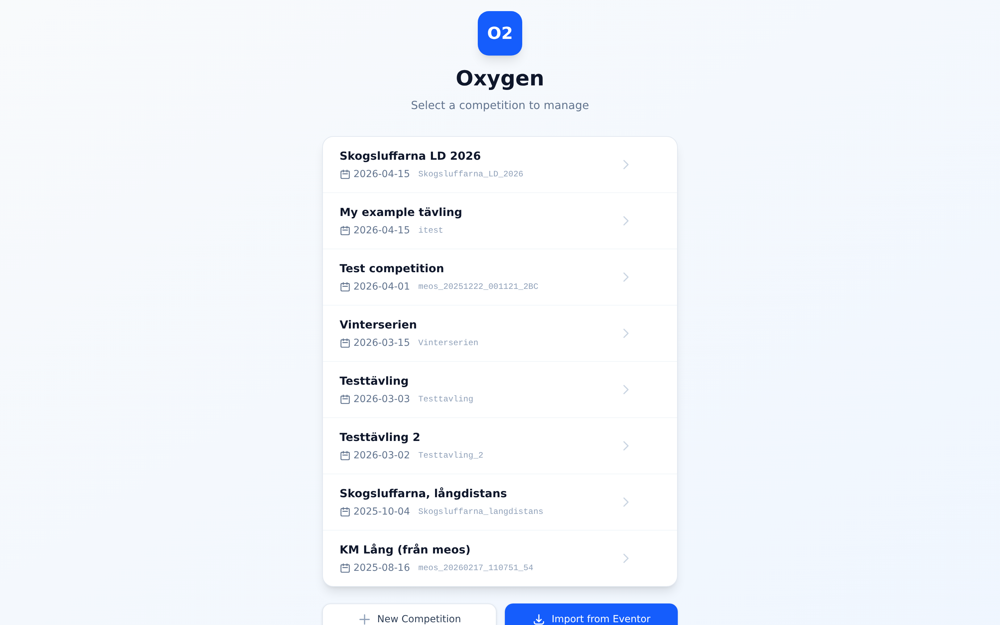

The dashboard shows real-time progress — how many runners have been read, class completion percentages, and overall race status.

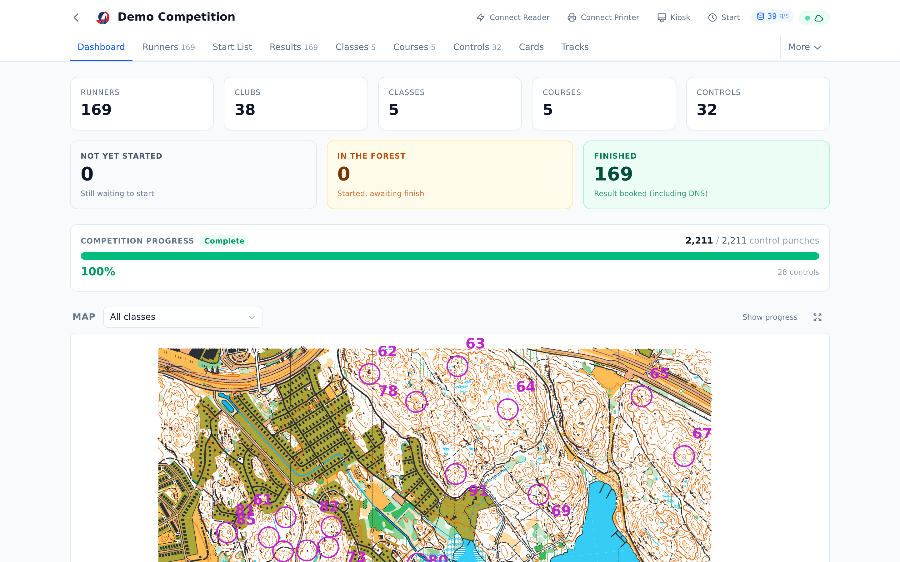

## Event Setup & Eventor Integration

The event page provides sync controls for the Swedish Orienteering Federation's Eventor system:

- **Eventor Sync** — import entries, classes, clubs, and competitors; upload start lists and results
- **Global Runner Database** — download the full runner database for name/card lookup during registration
- **Club Sync** — fetch club logos and metadata
- **LiveResults** — push live results to liveresultat.se with configurable intervals

## Runner Registration & Management

The runner list shows all registered competitors with their class, club, SI card, and status. Click any row to expand the inline detail pane for quick editing — name, class, club, times, punches, and status are all editable in place with auto-save.

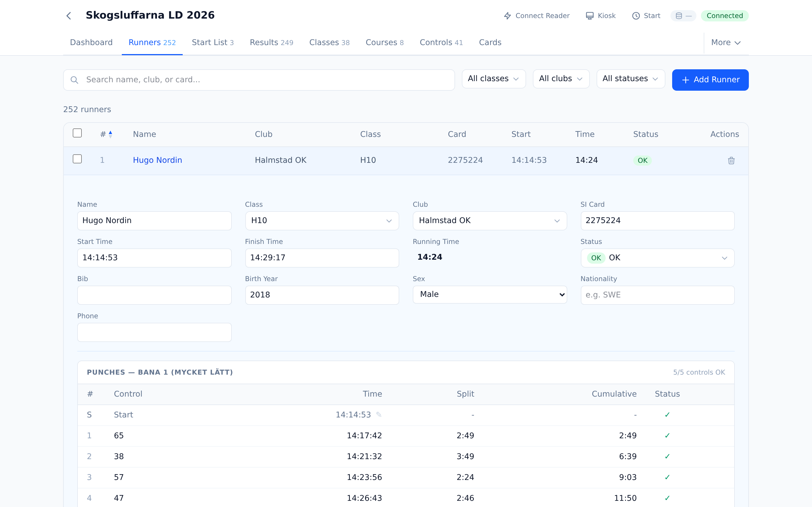

Select multiple runners using checkboxes to access bulk operations. The floating action bar lets you change class, status, or club for all selected runners at once.

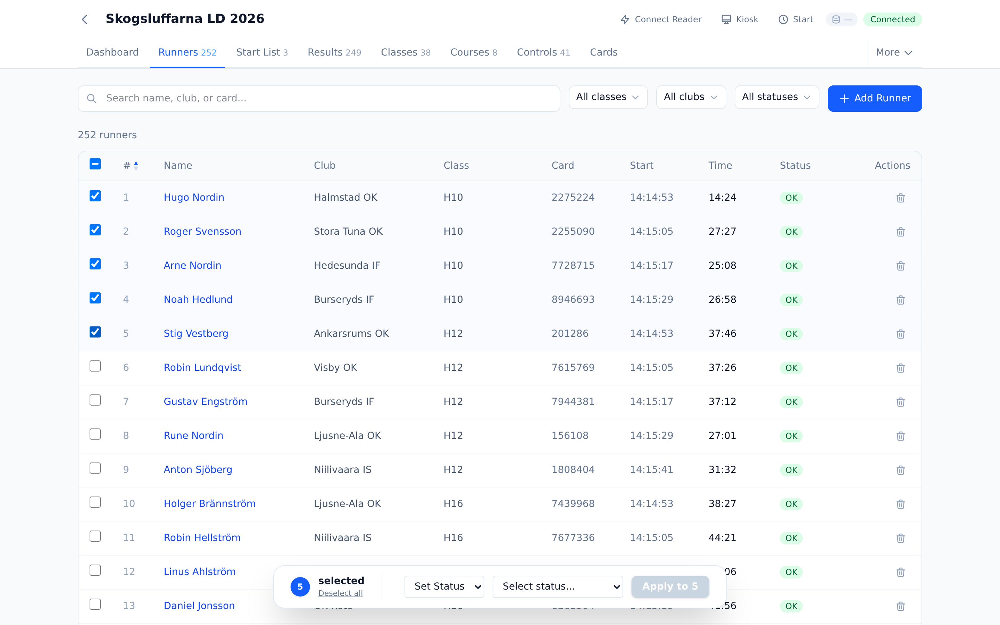

## Course, Class & Control Setup

Courses can be imported from OCAD files or IOF XML, or created manually. Each course defines a control sequence with distance and climb data. Classes are assigned to courses, and the system validates that all referenced controls exist.

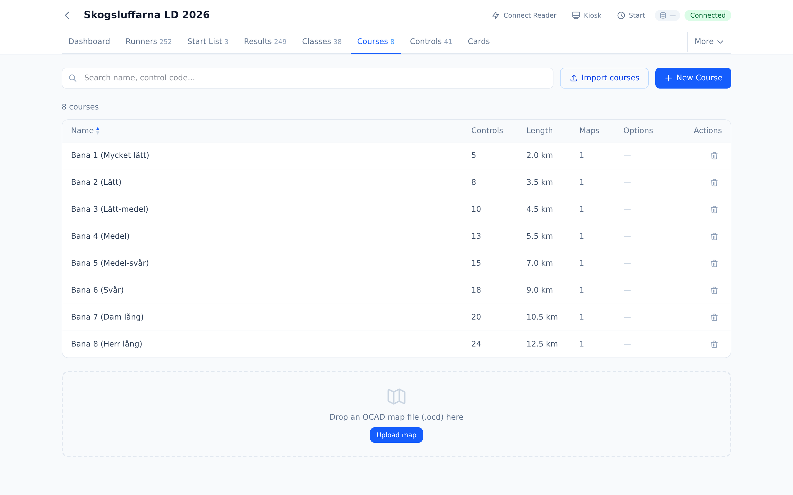

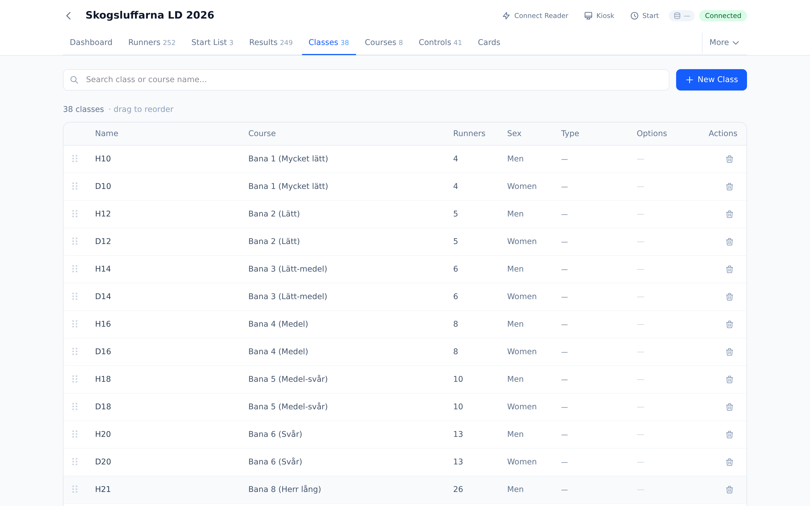

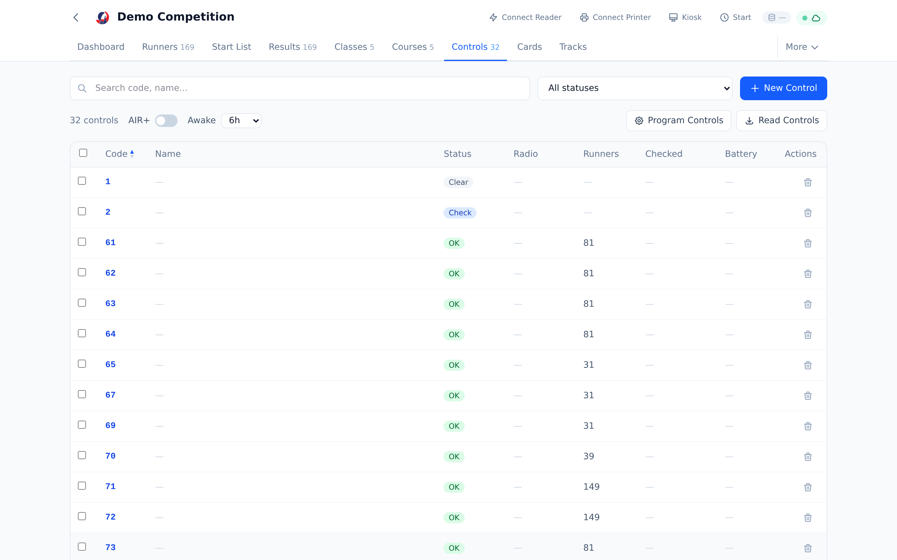

## Start Draw

The draw engine allocates start times with configurable methods:

- **Club separation** — prevents runners from the same club starting back-to-back
- **Random** — simple random allocation within each class
- **Seeded** — preserves a specific order (e.g., ranking-based)
- **Simultaneous** — mass start for all runners in a class

The graphical timeline shows how classes are distributed across corridors (parallel start lanes) and time. Classes sharing a first control are automatically separated. Drag class bars to rearrange the schedule.

After applying the draw, the start list shows all runners with their allocated start times.

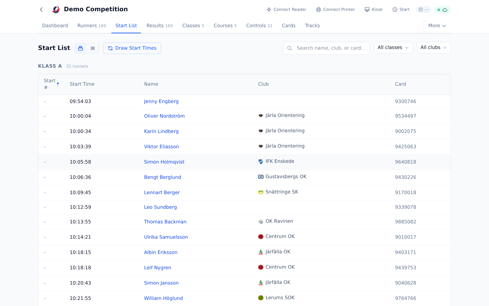

## SI Card Readout & Live Results

Oxygen reads SportIdent cards directly in the browser using the Web Serial API. Supported card types: SI5, SI6, SI8, SI9, SI10, SI11, SIAC, pCard, and tCard.

When a card is read, punches are validated against the course definition and a result is computed instantly — OK, missing punch, or DNF. Results update in real-time as cards are processed. Three-layer stale punch detection prevents data from previous races from polluting results. See [registration-and-readout.md](registration-and-readout.md) for the full technical flow.

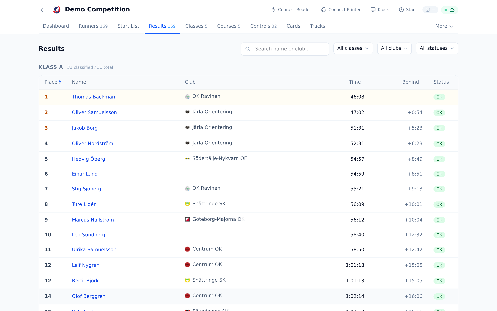

The cards page shows all readout data, including detailed punch information.

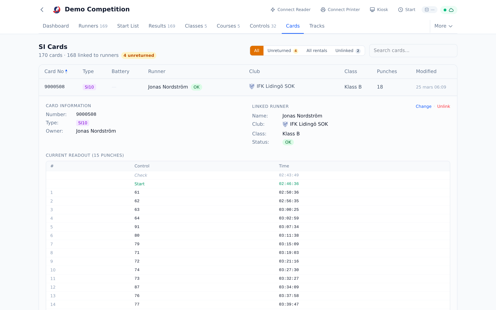

## Kiosk Mode

A self-service interface for race day operations, designed for a dedicated screen:

- **Registration** — runners insert their SI card, the organizer enters their details, and the runner confirms by re-inserting the card. Smart pre-fill from DB, Eventor, and card owner data (with factory default filtering).
- **Pre-start** — shows course information, clear/check verification, and a countdown to start time
- **Readout** — displays the result (OK, missing punch, DNF) with running time

The kiosk runs in a dark theme and communicates with the admin window via the BroadcastChannel API — no network required.

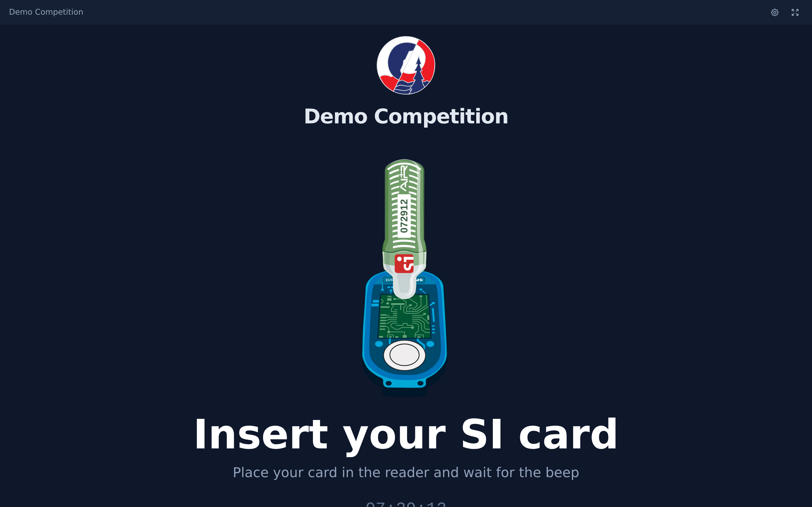

## Start Screen

A dedicated display for the start area, showing runners who are about to start. The screen automatically updates based on the current time, displaying the next group of runners with their class, name, and start time.

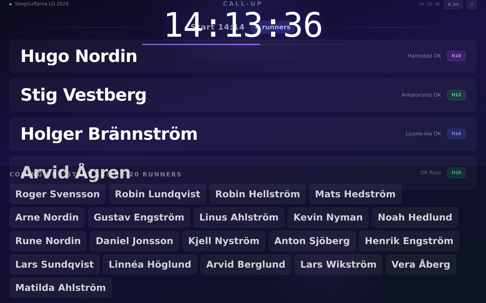

## Test Lab

The built-in Test Lab generates realistic test data for development and demos. It works through four stages:

1. **Generate Classes** — creates a standard Swedish long-distance class setup (38 classes)
2. **Generate Courses** — creates 8 tiered courses with ~50 controls and realistic course sharing
3. **Register Runners** — populate with GDPR-safe fictional runners (randomized Swedish names, mixed SI card types) or real runners from the Eventor database
4. **Race Simulation** — simulates a full race with realistic split times, including DNF, mispunch, and DNS anomalies

The simulation runs server-side so it doesn't depend on keeping the browser tab open. Speed can be adjusted in real-time (instant, 1x, 10x, 50x).

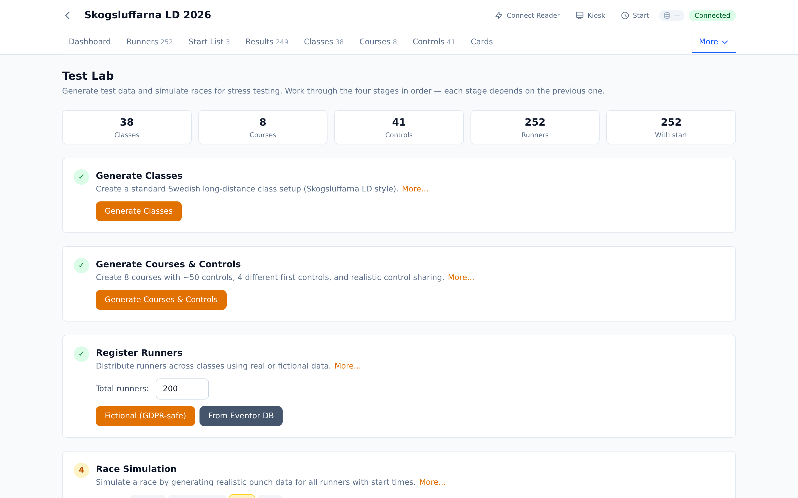

## MeOS Compatibility

Oxygen reads and writes the same MySQL schema as [MeOS](http://www.melin.nu/meos), the established Windows-based orienteering software. Both tools can operate on the same database simultaneously — changes made in MeOS are immediately reflected in Oxygen and vice versa. This allows a gradual migration path where organizers can use Oxygen for web-based features while keeping MeOS for legacy workflows.
