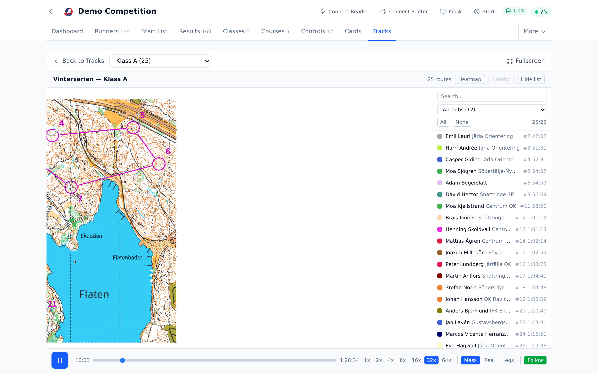
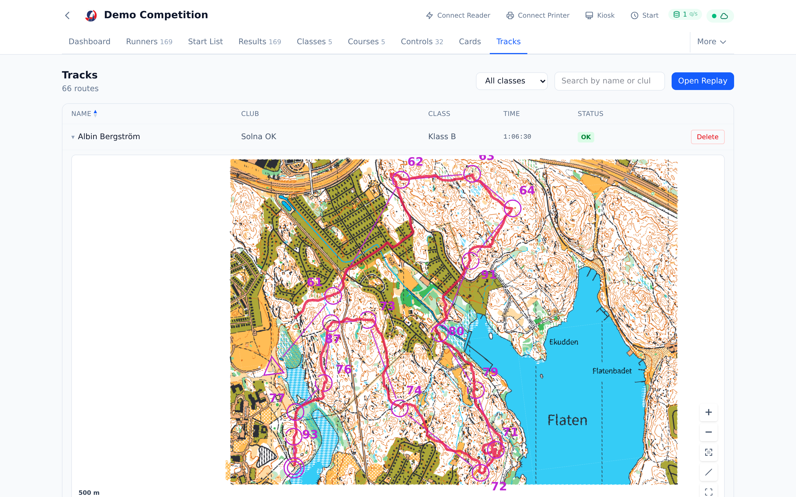
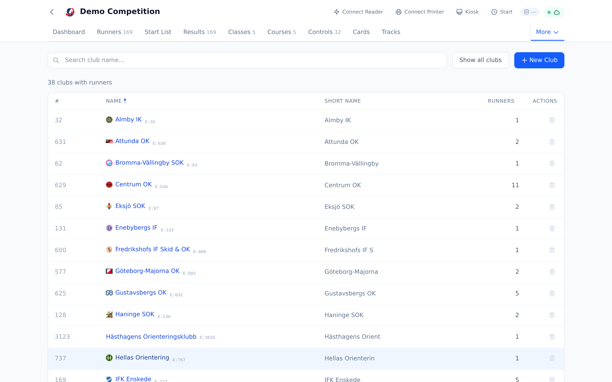
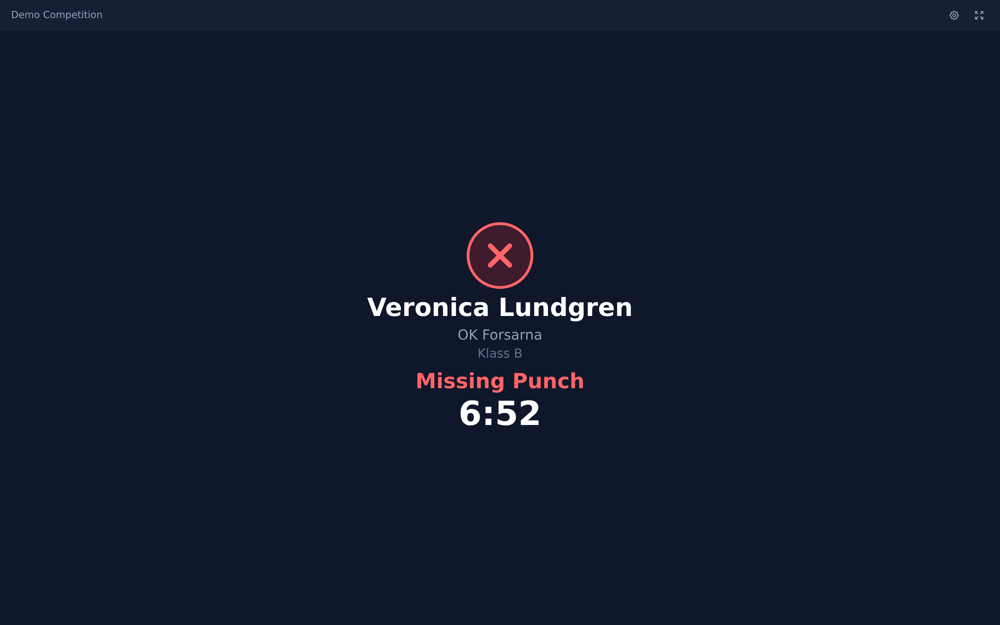
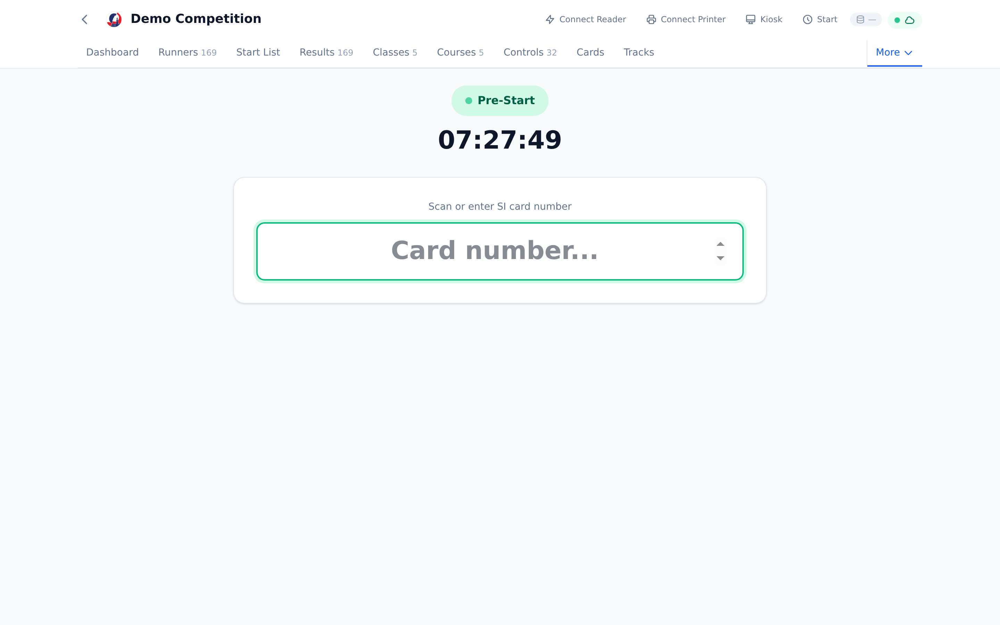
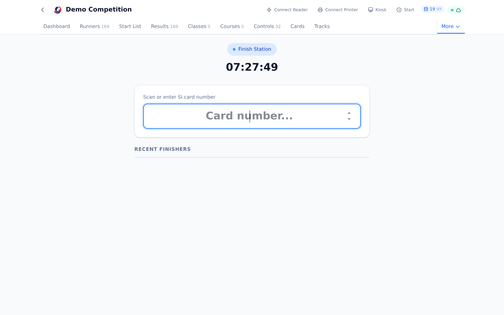
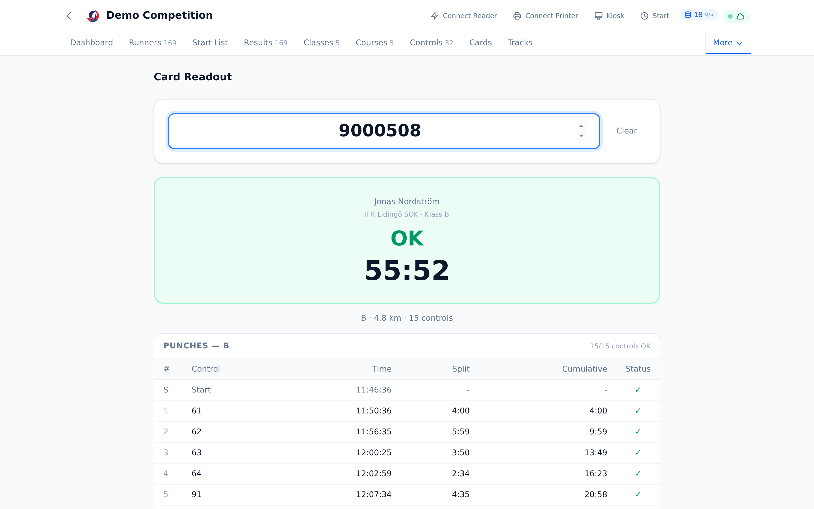
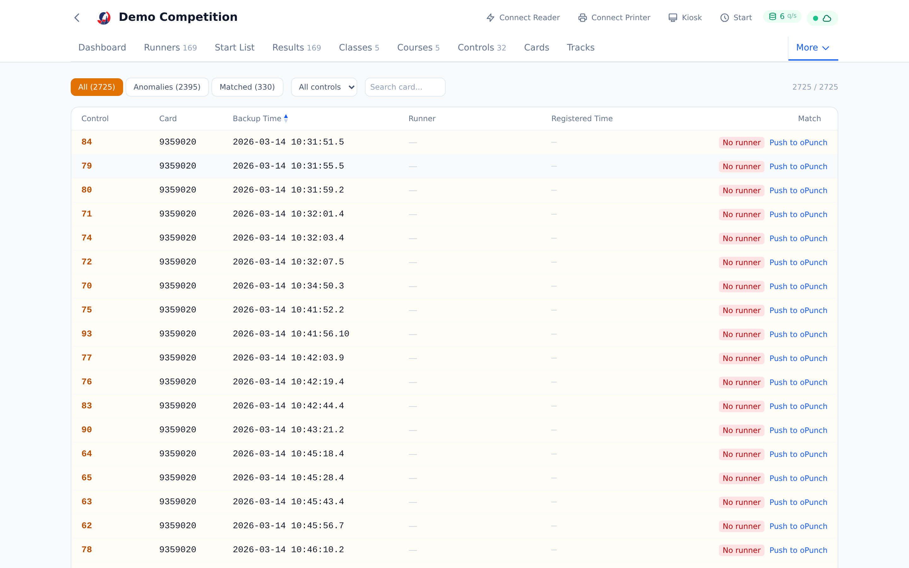

# Features

Oxygen is a browser-first race platform for orienteering events — from Eventor import, through start draw, card readout, and live results, all the way to GPS replays after the race.

This page is a visual tour. Every screenshot below is auto-generated by Playwright from the **Demo Competition** showcase — a committed fixture with real courses, controls, classes, GPS tracks, and map (derived from anonymized Vinterserien data) — so the images always match the current UI. Regenerate everything with `pnpm docs:screenshots`, or load the same showcase into your own DB with `pnpm showcase:load` to take custom screenshots.

---

## At a glance

A race director's workspace, kept fresh end to end — dashboard, draw, kiosk, and replay all backed by the same data.







---

## Before the Race

### Event setup and Eventor integration

The event page is mission control for external integrations. Everything the Swedish orienteering stack relies on is wired into one screen:

- **Eventor sync** — import entries, classes, clubs, and competitors; upload start lists and results in the IOF XML formats Eventor expects.
- **Global Runner Database** — download the federation-wide runner directory for fast name/card lookup at registration.
- **Club sync** — pull club metadata and logos.
- **LiveResults** — push live splits to [liveresultat.se](https://liveresultat.se) on a configurable interval.
- **Livelox** — link the event so GPS tracks flow back in automatically after the race (see the GPS section below).


### Courses and the map

Courses come from OCAD (`.ocd` / `.xml` course export), IOF XML, or can be authored directly. Upload the map once and every view — dashboard, courses, tracks, replay — renders against it. Control circles are placed automatically from the course coordinate system.


### Classes

Every class gets its own row of options: free start, no timing (for open / HD10-style classes), direct registration, and a maximum allowed running time. The table also shows how many runners, which course, and the class leg / length directly.


### Controls and SI units

The Controls page tracks two things side by side: the logical controls used in course definitions, and the physical SI station units that fulfill them. A single logical control can own multiple units — for redundancy at the same location, or after a mid-race unit swap with a different code.

Battery voltage, last-checked time, programmed code, and firmware are tracked per unit, so two stations never overwrite each other's state. When a control is programmed from the UI, the unit row is upserted automatically; backup-memory reads are attributed to the reading unit too.


### Clubs

Clubs are pulled from Eventor (or entered manually) and rendered with their real logos in every view — runner rows, start list, results, replay legend. It's a small thing but goes a long way on a public results screen.



### Runner list and bulk editing

Every registered competitor is on one page, with class, club, SI card, and status visible at a glance. Click any row to expand an inline detail pane — name, class, club, times, punches, and status are all editable in place with auto-save.


Select multiple rows and the floating action bar appears: change class, status, or club for all selected runners at once without leaving the page.


### Start draw

The draw engine allocates start times with configurable methods:

- **Club separation** — prevents runners from the same club starting back-to-back.
- **Random** — simple random allocation within each class.
- **Seeded** — preserves a specific order (e.g. ranking-based).
- **Simultaneous** — mass start for all runners in a class.

The graphical timeline shows how classes are distributed across corridors (parallel start lanes) and time. Classes sharing a first control are automatically separated; drag class bars to rearrange the schedule and re-run the draw without losing context.


After applying the draw, the start list shows every runner with their allocated start time — ready to print or sync back to Eventor.


---

## On Race Day

### Kiosk mode

A self-service interface designed for a dedicated touch screen at the arena. The kiosk runs in a dark theme and communicates with the admin window via the BroadcastChannel API — no network required. See [registration-and-readout.md](registration-and-readout.md) for the full state machine.

Idle — waiting for a card:


Successful readout — name, club, class, and total time appear the instant the card is returned:


Mispunch — the runner sees exactly what went wrong:



### Start and finish stations

Dedicated register-only stations for the arena — designed to run on cheap tablets and survive flaky Wi-Fi. Both stations work offline: mutations queue locally and drain when connectivity returns.





### Card readout

A dedicated readout workflow for organizers — type a card number (or scan one with a reader) and see the full splits table immediately, with status, course match, and per-control timing.



### Backup punches

SI backup-memory punches (the unit's local fallback when the chip read failed) land in a dedicated reconciliation view. Each backup punch is matched to a registered card/runner; unmatched rows are highlighted, and a one-click action pushes the reconciled punch into `oPunch` for the result engine to pick up.



### Start screen

A dedicated big-board display for the start area. The screen auto-advances to the next starting group based on the current time, showing class, name, and start time in a format readable from across a field.


### Dashboard

The race-day dashboard is the single view that answers "how are we doing?" — runner counts, clubs, classes, competition progress, and the live map with real-time control punches.


### Receipt printer

Oxygen supports direct USB receipt printing on Linux at the finish station and kiosk — no print server, no driver gymnastics. Splits, status, position, and personal best are rendered into an ESC/POS-compatible layout. See [receipt-printer-setup.md](receipt-printer-setup.md) for hardware notes.

---

## After the Race

### Results

Live results update as cards are processed — OK, mispunch, DNF, over max time, out of competition, no timing. Three-layer stale-punch detection ensures a card read today can't bring in phantom punches from a test run last week. See [registration-and-readout.md](registration-and-readout.md) for the full readout pipeline.


### Cards

Every readout lands here — card type, battery, owner, current punches, and status. Click a row to expand the full punch timeline with splits, cumulative times, and OK/extra/miss badges per control.


### LiveResults push

Enable LiveResults on the event page and Oxygen will push splits to [liveresultat.se](https://liveresultat.se) on the interval you pick (typically 30 s during a race). Punches flow through the same pipeline that drives the local results view, so what's published matches what's on screen.

---

## GPS and Replay

Livelox integration brings every GPS track on the course back into Oxygen after the race, matched to the registered runner, rendered on the same map the organizer uploaded. See [livelox-features.md](livelox-features.md) for the full integration contract.

### Tracks page

A sortable table of every synced route with class and name filters. Expand any row to see a map preview with the track overlaid, filtered to the runner's course controls only — so the graph isn't cluttered with circles the runner didn't visit.


### Replay viewer

Full animated GPS playback with mass-start / real-time / legs modes, variable speed (1x – 64x), follow mode, and per-runner visibility toggles. Light theme matching Oxygen's UI. Punch pulse animations at control points. Class selector in the header for quick switching between heats.


Under the hood, runner matching is a 3-tier strategy:

1. **Eventor person ID** (`ExtId`) — the canonical identifier when both systems have it.
2. **Club-scoped name match** with middle-name stripping — handles the common case where the Livelox name has an extra middle initial.
3. **Cross-club name fallback** — last resort for runners whose club field is sparse.

GPS waypoints land in an `oxygen_routes` table with nullable foreign keys to `oRunner` / `oClass`, so unmatched routes still appear and can be reconciled manually. Late GPS-lock correction derives the real start from `lastWaypoint - result.time` so a mass-start replay doesn't show someone visually arriving at the start a minute after everyone else.

---

## Platform

### Multiple competitions, side by side

Every competition lives in its own database, so you can keep last year's series, this weekend's race, and a draft for next month loaded at once. The selector is the landing page — pick one and the whole app re-scopes to that event.


### Offline and PWA

Oxygen is a Progressive Web App designed to work during internet outages — from brief drops to full-day operation at forest venues with no connectivity.

- **Service worker** precaches all static assets, so the app loads instantly even offline.
- **Pre-fetch on station pages** — runners, classes, courses, controls, and clubs are cached to IndexedDB when a start/finish/kiosk station mounts, and survive browser restarts and overnight power-off.
- **Event-based mutation queue** — all finish recordings, registrations, and edits are stored locally and drained to the server when connectivity returns. A visible banner tells you how many events are queued.
- **Local result computation** — the finish station runs the same course matching, status rules, and position ranking as the server, so it can print a valid receipt from cached data even while the network is down.

See [offline-architecture.md](offline-architecture.md) for the technical details and [future-architecture.md](future-architecture.md) for the post-MeOS vision with event sourcing.

### MeOS compatibility

Oxygen reads and writes the same MySQL schema as [MeOS](http://www.melin.nu/meos), the established Windows-based orienteering software. Both tools can operate on the same database simultaneously — changes in MeOS are immediately reflected in Oxygen and vice versa, enabling a gradual migration where organizers use Oxygen for web-based workflows while keeping MeOS for legacy ones.

Status calculation is fully MeOS-compatible — Oxygen computes every result status MeOS does: OK, DNF, Missing Punch, Over Max Time, No Timing, and Out of Competition. Per-runner flags (`TransferFlags`) such as OutOfCompetition and NoTiming are respected by the result engine and surfaced as badges in the runner detail view. Punch data round-trips correctly, including MeOS's `@unit` metadata for multi-unit timing setups.

### Web Serial card reader

Oxygen reads SportIdent cards directly in the browser using the Web Serial API. Supported card types: SI5, SI6, SI8, SI9, SI10, SI11, SIAC, pCard, tCard. No driver install, no desktop bridge — plug the reader into any Chromium-based browser and grant permission once per origin.

### Test Lab

The built-in Test Lab generates realistic test data for development, demos, and stress tests. It works through four dependent stages:

1. **Generate classes** — a standard Swedish long-distance class setup (38 classes).
2. **Generate courses & controls** — 8 tiered courses with ~50 controls and realistic course sharing.
3. **Register runners** — distribute runners across classes using GDPR-safe fictional names (randomized Swedish names, mixed SI card types) or real runners from the Eventor database.
4. **Race simulation** — a full race with realistic split times, including DNF, mispunch, and DNS anomalies. Runs server-side so it doesn't depend on keeping the browser tab open. Speed is adjustable in real time (instant, 1x, 10x, 50x).


### i18n

All UI strings flow through `react-i18next` with per-page translation files. English and Swedish ship today; adding a language is a matter of copying `packages/web/src/i18n/locales/sv/*.json` and translating the values.

### Architecture

A single-command local dev loop (`pnpm dev`) brings up a Fastify + tRPC API and a Vite + React PWA that both speak directly to the same MySQL database MeOS uses. See [architecture.md](architecture.md) for the full picture.

---

## Try it

Want to run it locally? The [demo guide](demo.md) walks through spinning up Oxygen against the committed **Demo Competition** showcase — the same anonymized dataset (derived from Vinterserien) that every screenshot on this page is captured from.

```
pnpm install
pnpm dev
pnpm docs:screenshots
```

All screenshots on this page were generated by the last command, against a seeded Demo Competition. To reproduce the exact state for manual screenshots or exploration, load it into your own MySQL:

```
pnpm showcase:load
```

See [scripts/load-showcase.sh](../scripts/load-showcase.sh) for `USE_DOCKER`, `DB_NAME`, and `FORCE` options.
