# Features

Oxygen is a browser-first race platform for orienteering events — from Eventor import, through start draw, card readout, and live results, all the way to GPS tracks after the race.

This page is a visual tour. Every screenshot below is auto-generated by Playwright from the **Demo Competition** showcase — a committed fixture with courses, controls, classes, cached overview tiles, and a generated backing map (anonymized Vinterserien-derived race data). Regenerate everything with `pnpm docs:screenshots`, or load the same showcase into your own DB with `pnpm showcase:load` to take custom screenshots.

Self-hosters can run the published GHCR image (`docker compose -f docker-compose.release.yml up -d`) — see [releases-and-images.md](releases-and-images.md).
The selector footer keeps the manually managed Oxygen version separate from
the deployed image tag and commit, so operators can confirm whether an
instance is running `edge`, a release, or an immutable SHA build.

---

## At a glance

A race director's workspace, kept fresh end to end — dashboard, draw, kiosk, and tracks all backed by the same data.

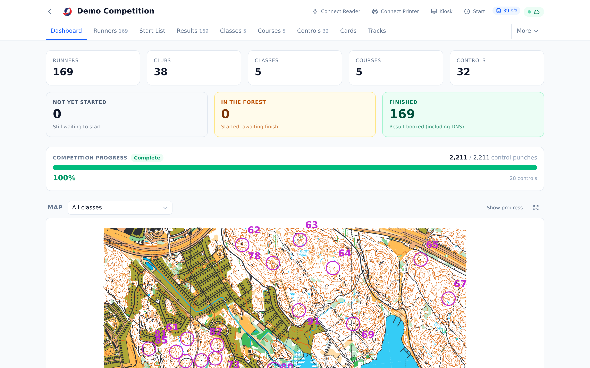


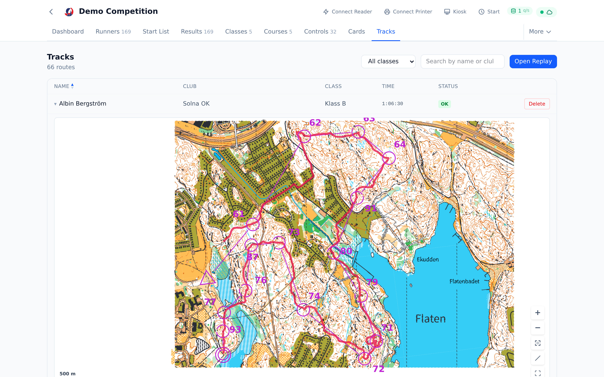

### Mobile and tablets

On phones and tablets the page zoom is locked, the competition shell header compacts to icon-only status pills with a sticky tab row, and inline maps nearly fill the viewport. One finger scrolls the page; two fingers pan and pinch-zoom the map. The course editor supports full touch editing (tap-select, drag-to-move controls, leg insert, dismiss button). Map toolbars include a **My location** control (Google Maps-style follow mode) for placing and collecting controls in the field. See [mobile-layout.md](mobile-layout.md).

---

## Before the Race

### Event setup and Eventor integration

The event page is mission control for external integrations. Everything the Swedish orienteering stack relies on is wired into one screen:

- **Editable event type** — choose a competition, training, weekly course, or
  custom label during creation and change it later under Event Info. Eventor
  initializes the label on import but later syncs cannot overwrite it; raw
  Eventor classification remains separate for reporting. See
  [event-types.md](event-types.md).
- **Eventor sync** — import entries, classes, clubs, competitors, and published class-course lengths; upload start lists and results in the IOF XML formats Eventor expects.
- **Global Runner Database** — download the federation-wide runner directory for fast name/card lookup at registration.
- **Club sync** — pull club metadata and logos.
- **LiveResults** — push live splits to [liveresultat.se](https://liveresultat.se) on a configurable interval.
- **Online Input (ROC)** — pull radio-control punches from [roc.olresultat.se](https://roc.olresultat.se) (or any ROC-protocol-compatible server) on a configurable interval. Punches land in the `punches` table tagged with their source so the result engine can deduplicate against later card readouts. See [docs/online-input-roc.md](online-input-roc.md).


### Courses and the map

Courses come from OCAD (`.ocd` / `.xml` course export), IOF XML, Purple Pen (`.ppen`), or can be authored directly. The import preview auto-matches the file's class assignments to the event's classes — and when the file has none (common for OCAD exports and always for `.ppen`, where courses are simply named after classes), it falls back to suggesting classes from the course names (see [course-import-class-fallback.md](course-import-class-fallback.md)). Upload the map once and every view — dashboard, courses, tracks — renders against it. Control circles are placed automatically from the course coordinate system. Club-wide base maps live in the club library, now the **Maps** tab of **Settings** (`/settings`): upload an OCAD file once, see its rendered preview thumbnail, then **From club library** on the event map panel copies it into that event. Later library edits do not change events that already copied the map. The OCAD file's own georeference is trusted as-is; what Oxygen checks is the map's drawn magnetic-north lines — an amber **north lines** badge (library card, course-editor map panel, and a one-off notice after upload) says how many degrees they lag behind today's magnetic north, so a course setter knows when to redraw them before printing. The same page’s **Controls** tab holds prioritized punch-code series (own units first, borrowed ranges after). The course editor allocates those codes instead of the bare ≥ 31 heuristic, and SRR-flagged units become internal radio controls on placement. See [club-library.md](club-library.md).

Control numbers are placed by a collision-aware algorithm: every number sits at the same visual distance from its circle, never on top of another circle or number, and in congested clusters where a number cannot be nearest to its own circle it gets a thin leader line tying it to the right circle (see [bugfix-control-number-placement.md](bugfix-control-number-placement.md)).

Selecting several courses shows all of them at once, with each leg labeled inline with the classes that run it — legs shared between courses carry the combined class list ("Öppen 1, Öppen 2"), so it's always clear which line belongs to whom. The labels render as pills embedded in the course line itself (exactly as tall as the line, centered on the visible span between the control circles), shrinking to fit short legs and disappearing rather than becoming unreadable — zoom in far enough for the line to carry them. With a single course selected, the Descriptions toggle renders a classic control card with sequence numbers (1, 2, 3, …); with several courses it keeps control codes on the map (no renumbering) and shows one combined, code-sorted description sheet covering every control on the selected courses. Map rotation is locked north-up by default — an accidental two-finger twist while pinch-zooming will not turn the map. The always-visible compass button cycles through the states: tap to unlock two-finger rotation, tap a rotated view back to north-up, tap again to relock; the choice is remembered per browser.

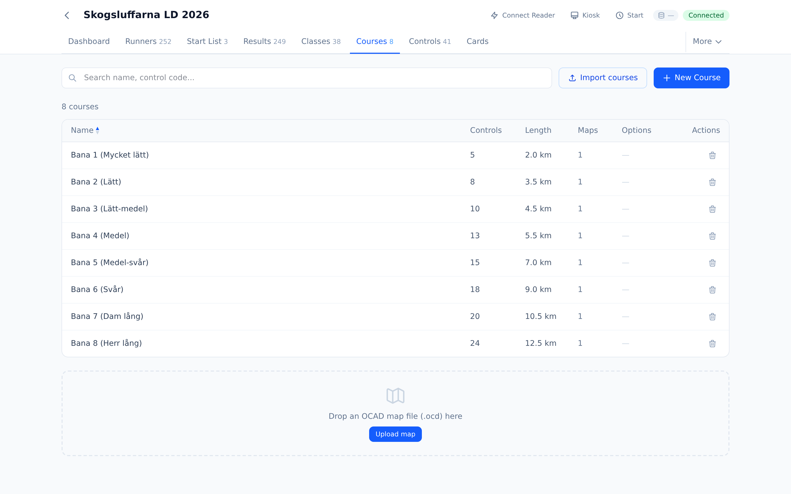

### Course editor

The Course Editor (overflow menu) turns the map into an editing surface with contextual actions — no tool switching: click empty map and a floating menu offers **Add control** (the next unused punch code from the club control series, or the smallest free code ≥ 31 if none are defined / all are used) or **Add to course**; click an existing control for **Add to course**, **Radio**, **Edit description** and **Delete**; click a course leg to **Insert into course** at that spot. A standalone collapsible inventory card shows every club series with used/free and SRR state and lets you pin code assignment to a specific series instead of the priority order; enabling radio on a non-SRR code offers an inline swap to the first free SRR unit. The same empty-map menu offers **Add start** and **Add finish** — code-less controls auto-named "Start 1" / "Mål 1" — and works on a brand-new event with no controls at all (the click transform comes from the map's calibration). With several starts placed, selecting one offers **Use as start for [course]**, so different courses can start from different points. Drag any control to move it — if it's shared, an amber chip warns which other courses the move affects, and the selection menu shows "Also in: …". **Edit description** opens a full IOF control-description editor: symbol pickers for every sheet column with English/Swedish tooltips, a dimensions field, and a live preview row. A floating panel over the map builds whole courses: create or clone a course, click it to edit, reorder or remove controls, and undo/redo sequence edits with `Ctrl+Z` / `Ctrl+Shift+Z`. Legacy first-as-start / last-as-finish flags remain honored by geometry and export but are now read-only badges on the Courses page. Pencil icons on the Courses and Controls pages deep-link straight into the editor. Positions are stored in map millimetres and converted to WGS84 server-side; moving a control rebuilds every affected course.

Descriptions get a head start from the map itself: place a control and the same menu proposes what it sits on — boulder, path, marsh, building — read straight out of the uploaded OCAD map's objects, with a side-of direction ("N side") when the control is beside the feature rather than on it. One click fills the description, `Ctrl+Z` takes it back — and moving a control re-offers suggestions for the new spot, since the old description no longer applies. The course panel floats over the map itself, so course building keeps working in fullscreen, and with no course selected the description sheet lists every control under an "All controls" title instead of going blank. See [course-editor.md](course-editor.md) for the architecture and [control-descriptions-and-editor-geometry.md](control-descriptions-and-editor-geometry.md) for the backend contract.

The overprint also cuts itself automatically, the way a careful course setter would by hand: control circles get slits and leg lines get gaps only for compact knolls and rock objects (rocky pits, boulders, large boulders and clusters). Long cliffs, paths, walls, buildings and areas stay uncut because the colour stack already keeps their ink readable. An **Auto cuts** toolbar toggle turns the automatic decoration off for the whole event when you want unbroken purple. Cuts are kept tight, clearing the small feature and no more, and existing editor courses migrate to the current cut algorithm on first view. Imported OCAD courses keep the slits authored in the file. Control numbers always have a narrow white halo for contrast over dense map ink in both the viewer and printed/PDF maps. Map ink that should sit above purple follows IOF colour-stack **profiles** (ISOM / ISSprOM / ISSkiOM / ISMTBOM, or auto from the file's Lower purple colour / map scale), with optional north lines kept under the course purple — see `docs/map-color-stack.md`. Events that share a club map share the tile cache via a content `renderKey`.

### Course maps and export for printing

The **Map templates / Kartmallar** page defines reusable paper, orientation,
scale, margins and shared layout objects. Structured search and expandable
rows match the other planning pages; club templates are imported from a
dedicated modal. The separate **Maps / Kartor** table lists every course,
assigns templates inline or in bulk, and expands to manage several
independently positioned sheets for one course. The paper-centric editor
preloads a cached high-resolution sheet so zoom and pan are immediate — and
**Align map** moves map and course as one; both preview and PDF are rotated so
meridian lines stand vertical on the page. Collapsible course-editor-style
panels (Tools, Page, Graphics, Objects, Properties) keep the canvas usable on
mobile; the Objects card lists and deletes anything, including perfectly
stacked objects, and warns when items sit outside the printable area. The
editor supports click-to-place text, rectangles, polygons and paths with a
shared fill mode (none / solid / white-out / ISOM 709 out-of-bounds hatch),
editable Bezier paths, and uploaded SVG/PNG graphics (free resize, Ctrl/Cmd
proportional, Shift crop) from a per-event or club library. Course overprint
follows ISOM: circles, numbers and lines enlarge with the map when the print
scale is larger than the base map scale (1:15000 printed at 1:7500 → 2×).
Layout changes autosave; the header matches the course editor (help, undo/redo,
zoom, fullscreen, close). The control-description block previews the real rows
of the selected course. Validation messages name the offending object rather
than an opaque id. Importing a club template drops map-anchored objects that
belonged to another event's map. Export produces one map, a whole course, all
controls, or the complete event as vector PDF. See
[course-maps.md](course-maps.md).

The Courses page also keeps its format **Export** dropdown. It writes the whole course set — controls with paper-millimetre positions, course sequences with leg lengths, and (for IOF) class assignments — as either an IOF 3.0 CourseData file or a native Purple Pen `.ppen`. Open the IOF file in Condes, Purple Pen or OCAD, or import either format into another Oxygen event; the round-trip through Oxygen's own importer is lossless for the punchable course model. Export derives legs from the current coordinates and OCAD CRS scale; edited courses also get a freshly-derived total, while untouched imports retain deliberate OCAD/IOF extra distance. For Eventor-linked events, sync can repair an untouched imported total from Eventor's published class-course length but never overwrites a course edited in Oxygen. See [iof-coursedata-export.md](iof-coursedata-export.md), [ppen-import-export.md](ppen-import-export.md), [bugfix-ocad-course-scale-and-export-lengths.md](bugfix-ocad-course-scale-and-export-lengths.md), and [bugfix-eventor-course-lengths.md](bugfix-eventor-course-lengths.md).

### Classes

Every class gets its own row of options: free start, no timing (for open / HD10-style classes), direct registration, and a maximum allowed running time. The table also shows how many runners, which course, and the class leg / length directly. The Club library's **Classes** tab stores the recurring catalogue once; a new event can bulk-add the relevant presets while preserving all settings and skipping names already present. Course creation then suggests classes that still lack a course, and an exact name selection links the new course to that class atomically.

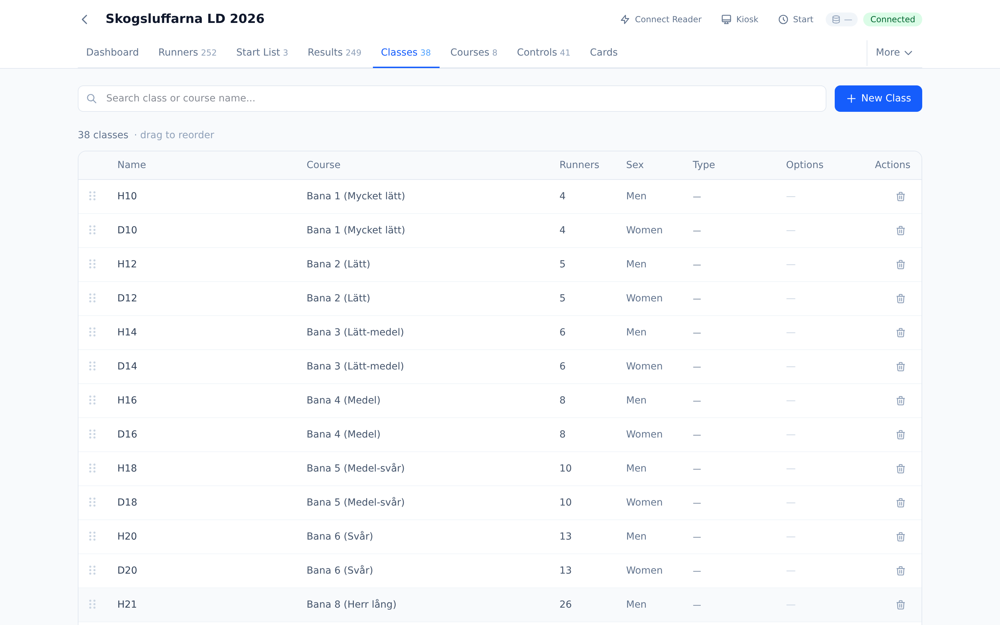

### Controls and SI units

The Controls page tracks two things side by side: the logical controls used in course definitions, and the physical SI station units that fulfill them. A single logical control can own multiple units — for redundancy at the same location, or after a mid-race unit swap with a different code.

Battery voltage, last-checked time, programmed code, firmware, and hardware type are tracked per unit, so two stations never overwrite each other's state. The list view also shows an aggregated **Type** column (`BSF8 / BSF9` when mixed units fulfill the same control), and unit rows expose capability badges such as **AIR+** where applicable.

Programming now performs a post-write SYS_VAL refresh before persisting battery data, which removes the old "freshly woken control shows exactly 3.00 V" artifact. The power-off sequence also returns the BSM8 to direct mode after OFF so the next coupling-coil probe doesn't immediately re-wake a just-programmed sleeping unit.

When a control is programmed from the UI, the unit row is upserted automatically; backup-memory reads are attributed to the reading unit too. The station's volts reading is converted to the millivolts the API stores, and a station that was programmed but whose record could not be saved now reports the failure instead of looking like a success — see [bugfix-control-programming-battery-units.md](bugfix-control-programming-battery-units.md).

The pre-competition programming panel's target-control picker is ordered by control number rather than the import order the API returns, so a code can be found by scanning.

Autosend follows the radio type rather than AIR+, since SRR transmission and contactless punching are independent features. A check station or a plain control with an SRR module therefore gets the protocol-level autosend gate without entering beacon mode, while clear and readout stations no longer offer a variant they would discard — see [bugfix-check-station-autosend.md](bugfix-check-station-autosend.md).

The structured search bar supports an `ordinal:` filter for a control's position within a course, matching when any course has it at that position — `ordinal:1` lists every course's first control, `ordinal:-2` the second-to-last before finish (negative values count from the end), and comma lists combine (`ordinal:1,-1`).

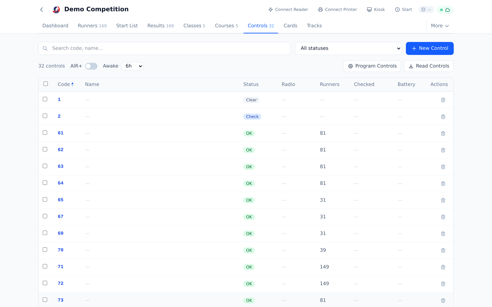

### Clubs

Clubs are pulled from Eventor (or entered manually) and rendered with their real logos in every view — runner rows, start list, results. It's a small thing but goes a long way on a public results screen.

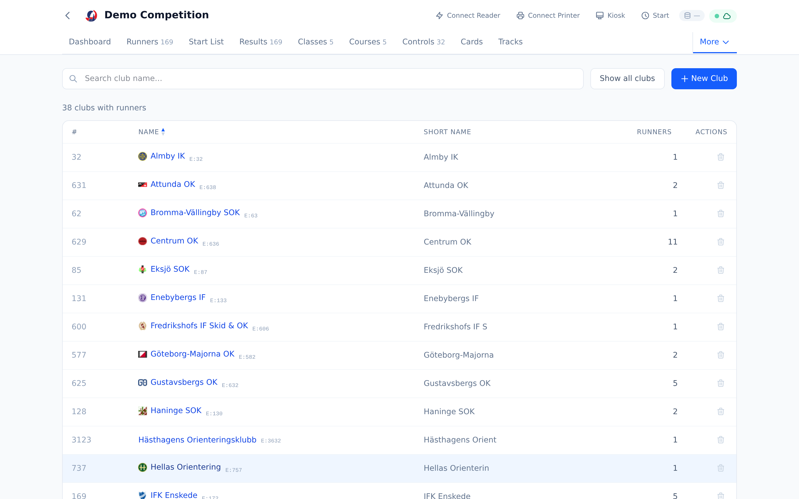

### Registration trends

The registration trend page (overflow nav → **Trends**) plots when runners signed up for the competition — useful both retroactively and during the countdown days when last-minute entries decide whether you need extra start corridors. The same chart can overlay comparable historical events from Eventor; the curves are aligned by *days before race* so different events with different start dates can be compared at a glance. See [registration-trends.md](registration-trends.md) for the data sources, cache strategy, and rate-limit handling.

### Runner list and bulk editing

Every registered competitor is on one page, with class, club, SI card, and status visible at a glance. Click any row to expand an inline detail pane — name, class, club, times, punches, and status are all editable in place with auto-save.

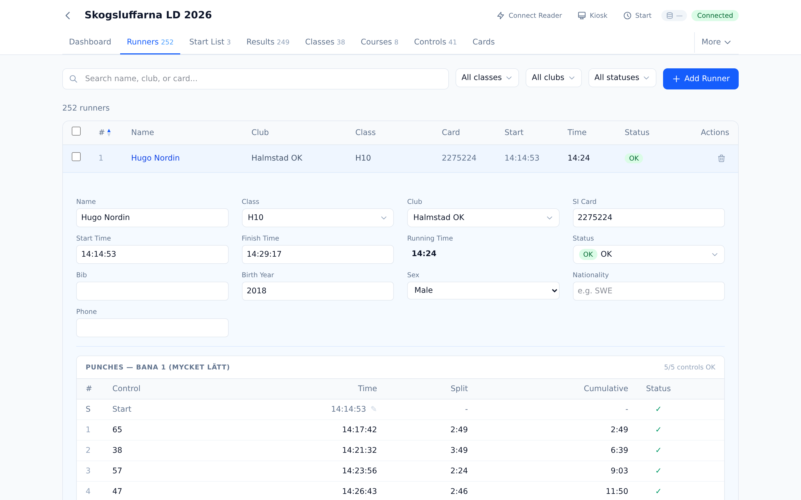

Select multiple rows and the floating action bar appears: change class, status, or club for all selected runners at once without leaving the page.

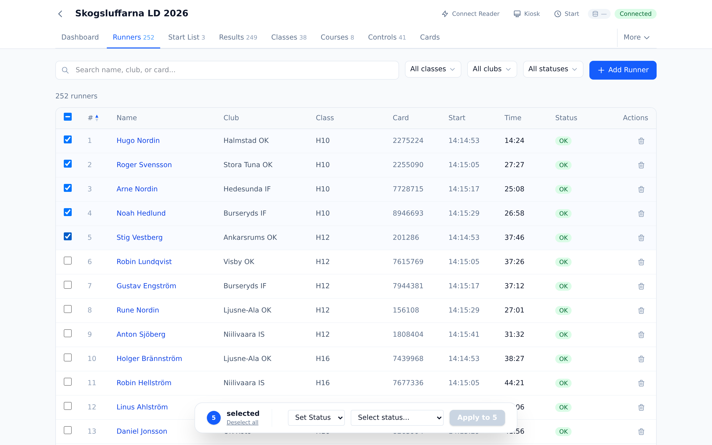

### Start draw

The draw engine allocates start times with configurable methods:

- **Club separation** — prevents runners from the same club starting back-to-back.
- **Random** — simple random allocation within each class.
- **Seeded** — preserves a specific order (e.g. ranking-based).
- **Simultaneous** — mass start for all runners in a class.

The graphical timeline shows how classes are distributed across corridors (parallel start lanes) and time. Each bar covers the class's whole start window, up to and including the last runner's slot, so consecutive classes in a corridor meet edge to edge. Classes on the same course share a corridor and run one after another. Drag class bars to rearrange the schedule and re-run the draw without losing context.

Three settings control how the parallel lanes are phased:

- **First-control gap** (global, MM:SS, default 1:00) is the minimum time between any two runners heading for the same first control. Classes that share a first control still run in parallel — the draw interleaves them. Two classes on a 2-minute interval sharing control 31 end up on alternating minutes rather than one waiting out the other. Unchecking the box next to the field turns the constraint off entirely.
- **Stagger corridors** (global, MM:SS) shifts each corridor relative to the previous one, wrapped within the class interval. With 8 lanes on a 2-minute interval and a 1-minute stagger you get 4 starters every minute instead of 8 every second minute.
- **Offset** (per class, MM:SS) shifts a single class's block. For the first class in a corridor it replaces the corridor's stagger phase; for a stacked class it shifts the block relative to where it would otherwise land.

If a class's own start interval is shorter than the first-control gap, the draw warns — its runners are already closer together at the control than the gap allows.


After applying the draw, the start list shows every runner with their allocated start time — ready to print or sync back to Eventor.

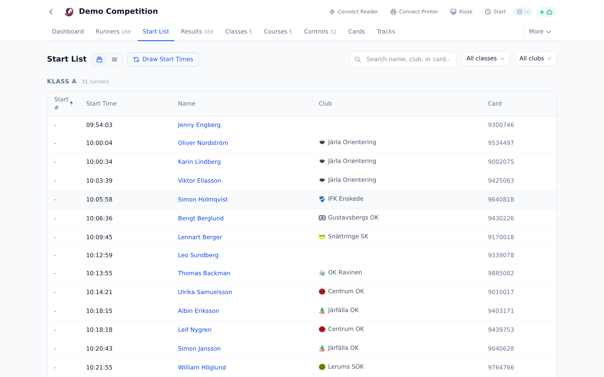

---

## On Race Day

### Kiosk mode

A self-service interface designed for a dedicated touch screen at the arena. The kiosk runs in a dark theme and communicates with the admin window via the BroadcastChannel API — no network required. See [registration-and-readout.md](registration-and-readout.md) for the full state machine.

Idle — waiting for a card:

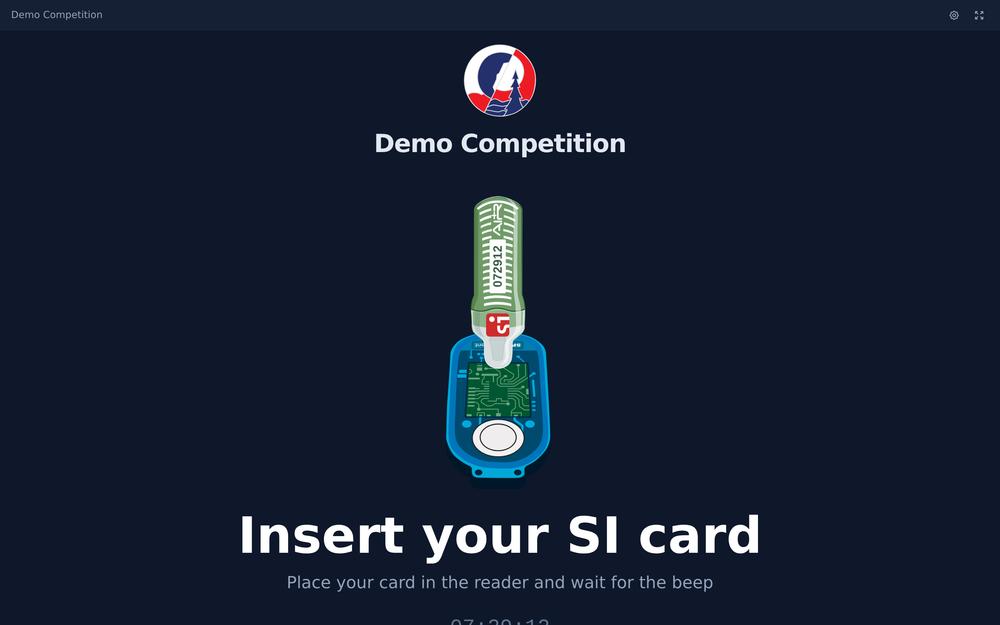

Successful readout — name, club, class, and total time appear the instant the card is returned:


Mispunch — the runner sees exactly what went wrong:

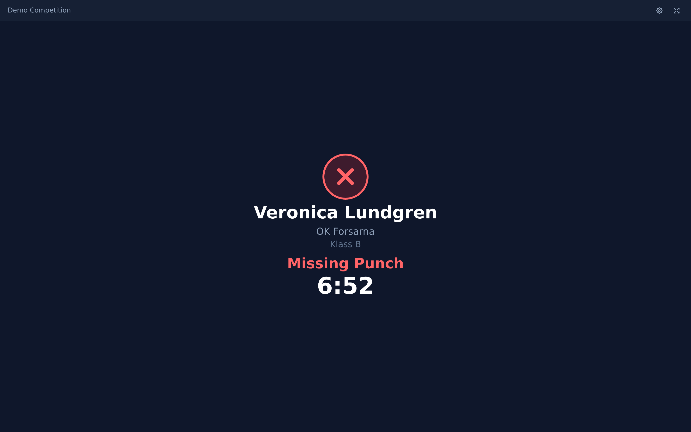

### Start and finish stations

Dedicated register-only stations for the arena — designed to run on cheap tablets and survive flaky Wi-Fi. Both stations work offline: mutations queue locally and drain when connectivity returns.

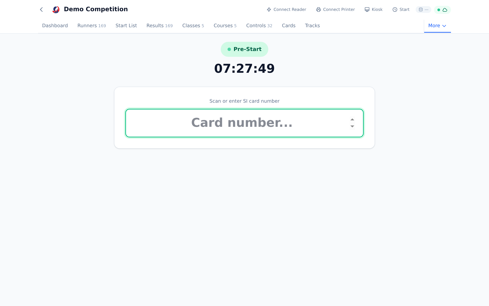

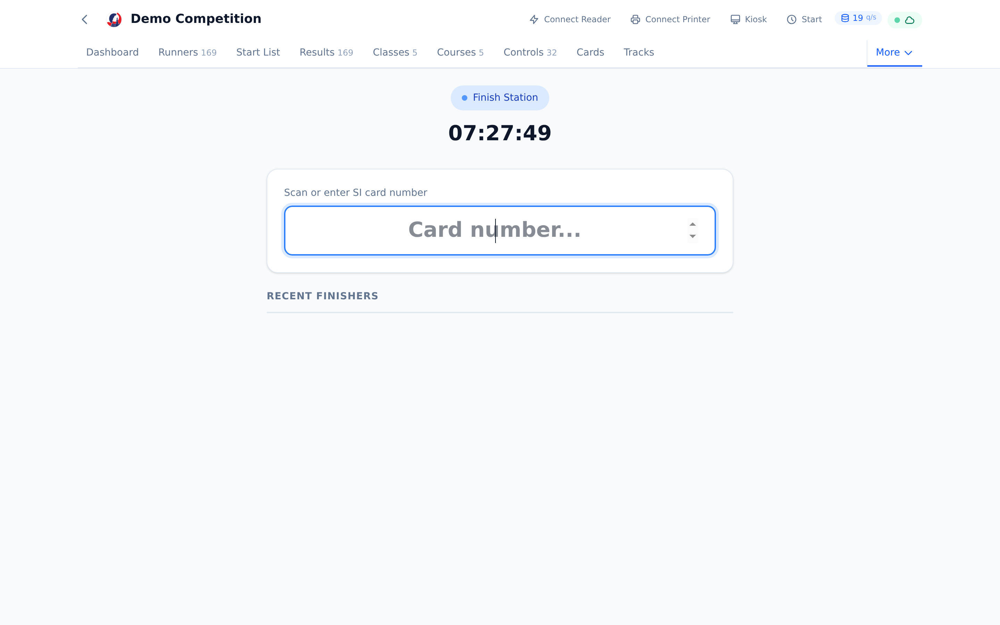

### Card readout

A dedicated readout workflow for organizers — type a card number (or scan one with a reader) and see the full splits table immediately, with status, course match, and per-control timing.

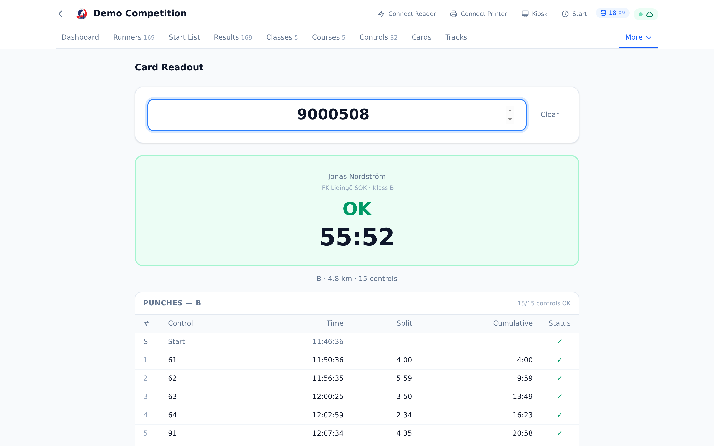

### Backup punches

SI backup-memory punches (the unit's local fallback when the chip read failed) land in a dedicated reconciliation view. Each backup punch is matched to a registered card/runner; unmatched rows are highlighted, and a one-click action pushes the reconciled punch into the `punches` table for the result engine to pick up.

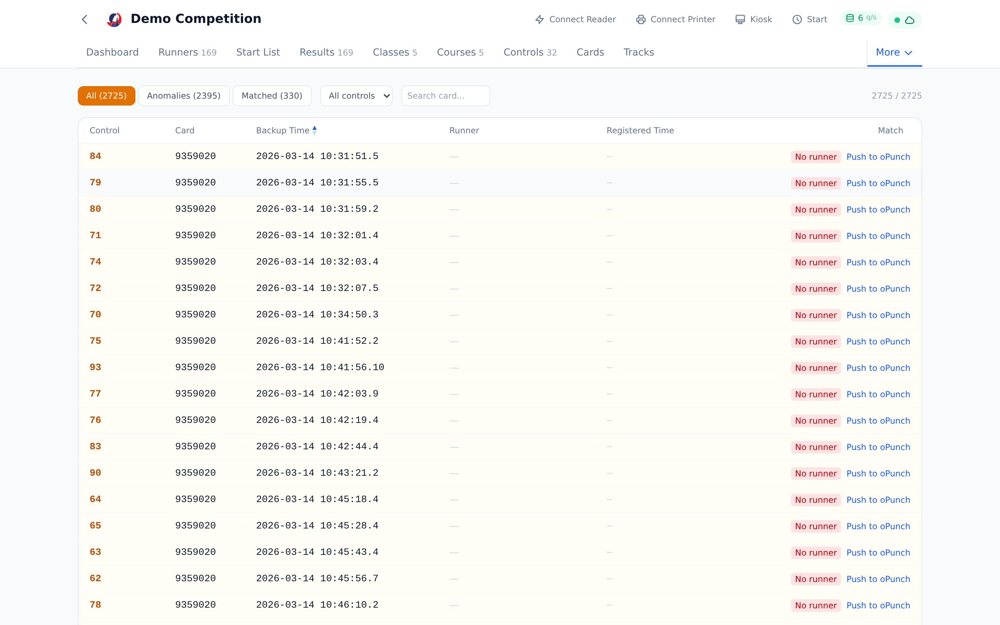

### Readout-station backup recovery

The same Backup Punches page also recovers full card readouts from a SI **readout station's** internal flash. This is the last-line-of-defence when Oxygen itself is broken and runners have read out on a standalone readout station — Oxygen wasn't there to hear the readout, but the station's own beep confirmed it landed in flash. Later, the operator dumps the flash through the Read Controls panel, reviews the recovered card readouts on the Backup Punches page's "Card readouts" tab, and pushes selected rows through the normal `storeReadout` pipeline — each one gets results, splits, and (optionally) a retroactive receipt as if it had happened live. Full details in [`docs/registration-and-readout.md`](registration-and-readout.md#11-readout-station-backup-memory-recovery) and [`docs/si-protocol/readout-backup-format.md`](si-protocol/readout-backup-format.md).

### Start screen

A dedicated big-board display for the start area. The screen auto-advances to the next starting group based on the current time, showing class, name, and start time in a format readable from across a field.

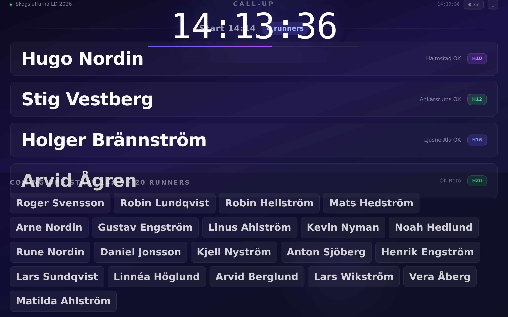

### Dashboard

The race-day dashboard is the single view that answers "how are we doing?" — runner counts, clubs, classes, competition progress, and the live map with real-time control punches.


### Receipt printer

Oxygen supports direct USB receipt printing on Linux at the finish station and kiosk — no print server, no driver gymnastics. Splits, status, position, and personal best are rendered into an ESC/POS-compatible layout. See [receipt-printer-setup.md](receipt-printer-setup.md) for hardware notes.

---

## After the Race

### Results

Live results update as cards are processed — OK, mispunch, DNF, over max time, out of competition, no timing. Three-layer stale-punch detection ensures a card read today can't bring in phantom punches from a test run last week. See [registration-and-readout.md](registration-and-readout.md) for the full readout pipeline.

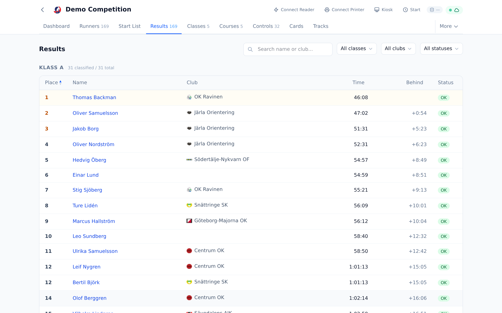

### Cards

Every readout lands here — card type, battery, owner, current punches, and status. Click a row to expand the full punch timeline with splits, cumulative times, and OK/extra/miss badges per control.

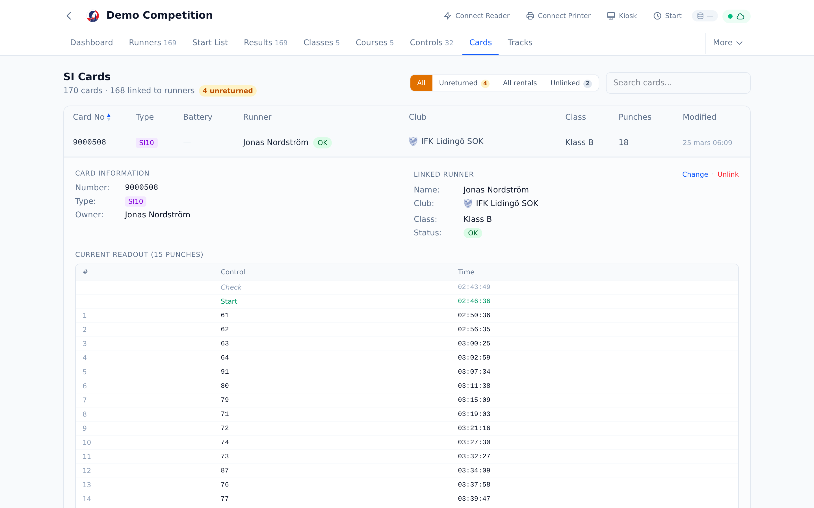

### LiveResults push

Enable LiveResults on the event page and Oxygen will push splits to [liveresultat.se](https://liveresultat.se) on the interval you pick (typically 30 s during a race). Punches flow through the same pipeline that drives the local results view, so what's published matches what's on screen.

Radio controls are stored in LiveResults' `visit × 1000 + code` form (first punch of 82 → `1082`) so a MeOS upload to the same competition can share the radio columns. Each sync only rewrites `splitcontrols` for Oxygen's own class names; it does not wipe radios another client attached under a different class name. Do not leave Oxygen's pusher and MeOS Resultat-online running against the same `tavid` at once — they still disagree on class names (`U4` vs `U4 3 km`) and runner ids.

---

## GPS Tracks

GPS routes live in a `routes` table alongside the rest of the event data, with nullable foreign keys to `runners` / `classes` so unmatched routes still appear and can be reconciled manually. They render on the same map the organizer uploaded.

Ingestion is currently out of scope: Oxygen reads and displays what is in the `routes` table but does not fetch tracks from any third-party service. The intended path forward is [Eventor's GPS-track upload](https://eventor.orientering.se), which is an official, organizer-authorized interface.

### Tracks page

A sortable table of every route with class and name filters, and structured search over name, club, class, time, and status. Expand any row to see the track overlaid on the competition map, filtered to the runner's course controls only — so the graph isn't cluttered with circles the runner didn't visit.


### Replay components

The `ReplayViewer` component tree (`packages/web/src/components/replay/`) renders a source-agnostic `ReplayData` structure: animated GPS playback with mass-start / real-time / legs modes, variable speed, follow mode, per-runner visibility, speed-coloured static track overlay, and heatmap. It also handles relay legs and forked courses, matching each runner to the fork they actually ran from their punch sequence.

The components are in the tree and unit-tested, but no page currently feeds them — they are waiting on the Eventor GPS-track integration to supply `ReplayData`.

---

## Platform

### Multiple competitions, side by side

Every event lives in the single `oxygen` database, scoped by `event_id`. The selector is the landing page — pick one and the whole app re-scopes to that event.

The list is grouped into **Upcoming** (`date >= today`) and **Past**, denser than the original card so clubs can keep many events loaded. A search box matches name, slug, annotation, and custom event type. The type filter uses Oxygen's editable type catalogue, including club training, weekly course, and a stable Other bucket for custom labels.

Creating an event asks for name, type, and date. For events created by an
invited user, the selector also shows that creator. The old per-event MySQL
host fields are gone.

When `AUTH_MODE=proxy` (or `dev`), the selector and event shell require a
signed-in user. Identity comes from a trusted reverse-proxy header — Oxygen
never stores passwords. With `AUTH_AUTO_PROVISION=member` (Cloud Run),
anyone IAP admits is created as a plain member on first sight; otherwise
the account must be invited. Instance admins manage people from **Settings
→ Users** (`/settings?tab=users`) — display name, role, club groups, last
seen, and active. Per-event **roles** (Event admin, Course setter, Race crew,
Member) hide tabs and block APIs the user is not granted; a role can be
given to a single user or to a **club group** — a named set of users
defined on the Settings page's Groups tab, whose membership changes apply
to every granted event immediately. After a race is completed, every
invited user can view courses, maps, and results. Kiosk and start screen
stay reachable without an invite when the URL includes a kiosk key
(`?k=`); see [authentication.md](authentication.md). Club OCAD source
files stay behind admin (or the library uploader); see
[club-library.md](club-library.md#ocad-source-files).

Inside an event, the admin tab bar starts with planning pages (Dashboard, Classes, Courses, Controls, Course editor). Runners, start lists, results, cards, and tracks move into the More menu until the event has entries or results — they are never unreachable. Race-day stations stay in More.

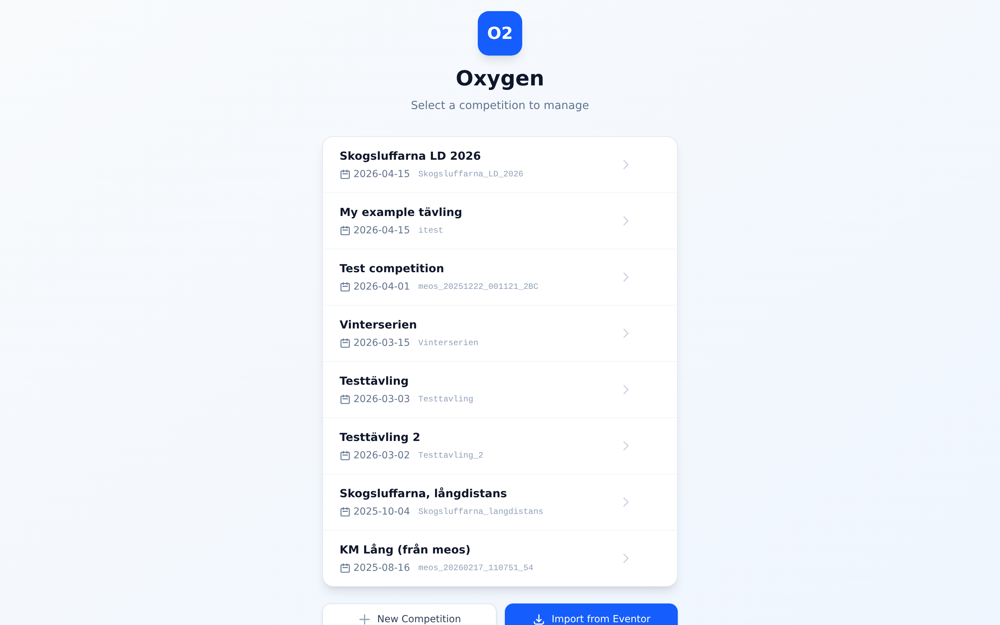

The Oxygen mark at the top of the competition list — an orienteering flag
with a compass-rose "O" — is a **live compass** on phones: the needle turns
to real north from the device orientation sensor. On iOS the first tap on
the logo asks for motion permission — once only, since the grant is
remembered and silently restored on later app starts; on Android it just
works; on a desktop without a sensor the needle rests at north. The same
mark is the favicon and the PWA / home-screen icon. See
[app-icon.md](app-icon.md).

### Offline and PWA

Oxygen is a Progressive Web App designed to work during internet outages — from brief drops to full-day operation at forest venues with no connectivity.

- **Service worker** precaches all static assets, so the app loads instantly even offline.
- **Update prompt** — an open tab checks for a newly deployed bundle every minute and offers a reload, which activates the waiting service worker rather than serving the precached bundle again. The build timestamp is shown in the Sync Status footer and on the competition list, so a stale tab is recognisable — see [bugfix-stale-web-bundle-after-deploy.md](bugfix-stale-web-bundle-after-deploy.md).
- **IAP session recovery** — if a dormant installed PWA wakes with an expired Google IAP cookie, `/trpc` fails as CORS `Failed to fetch`. The shell shows **Reconnecting…** (not **Event not found**), retries once, and may reload to refresh the cookie — see [bugfix-pwa-iap-session-recovery.md](bugfix-pwa-iap-session-recovery.md).
- **Pre-fetch on station pages** — runners, classes, courses, controls, and clubs are cached to IndexedDB when a start/finish/kiosk station mounts, and survive browser restarts and overnight power-off.
- **Event-based mutation queue** — all finish recordings, registrations, and edits are stored locally and drained to the server when connectivity returns. A visible banner tells you how many events are queued.
- **Local result computation** — the finish station runs the same course matching, status rules, and position ranking as the server, so it can print a valid receipt from cached data even while the network is down.
- **Clock-skew warning** — every queued mutation is stamped with a hybrid logical clock, and each sync compares this device's clock to the server's. If they differ by more than 30 seconds a persistent banner warns that times recorded here may be inaccurate.

See [offline-architecture.md](offline-architecture.md) for the technical details and [future-architecture.md](future-architecture.md) for the post-MeOS vision with event sourcing — its **Phase 1** (HLC-stamped journal, one-card-per-event invariant, idempotent ingestion) landed in June 2026.

### MeOS migration

Oxygen began life as a MeOS-compatible Swiss-army knife and originally read/wrote the same MySQL layout as [MeOS](http://www.melin.nu/meos). That compatibility layer was retired in May 2026 in favour of a single PostgreSQL 18 database — see [`migrations/2026-drop-meos.md`](migrations/2026-drop-meos.md) for the rationale and the one-shot CLI that moves an existing MeOS database into the new schema.

The status-calculation rules that originated in MeOS are still honoured by Oxygen's result engine: OK, DNF, Missing Punch, Over Max Time, No Timing, and Out of Competition. Per-runner flags such as `OutOfCompetition` and `NoTiming` are respected and surfaced as badges in the runner detail view.

### Settings

Everything that is club-wide rather than event-wide lives on one **Settings** page (`/settings`), reached from the button under the event list. Its tabs are Maps, Controls, Classes, and Groups (the club library, open to any signed-in user) plus Users and Maintenance (instance admins only). Maintenance holds **Clean up deleted records**, which permanently purges events that were soft-deleted from the event list. The older `/library` and `/admin/users` URLs redirect here. See [club-library.md](club-library.md).

Deleting an event from the start page is a soft delete: it disappears from the list, and the data survives until an admin purges it under Settings → Maintenance.

### Event backup

The Event page exposes a one-click **Download backup** button that streams a per-event PostgreSQL dump (CSV `\copy` of every event-scoped table) to your browser. The scope is exactly one event: its courses, classes, runners, cards, punches, readouts, map and tiles, and tracks — not other events, and not the shared runner and club directories. The dump is prefixed with a header that includes a ready-to-run (commented) `INSERT INTO oxygen.events` statement, so a restore can re-create the event row on a fresh database without manual SQL. See [backup-restore.md](backup-restore.md) for the full restore workflow.

### Web Serial card reader

Oxygen reads SportIdent cards directly in the browser using the Web Serial API. Supported card types: SI5, SI6, SI8, SI9, SI10, SI11, SIAC, pCard, tCard. No driver install, no desktop bridge — plug the reader into any Chromium-based browser and grant permission once per origin.

### Test Lab

The built-in Test Lab generates realistic test data for development, demos, and stress tests. It works through four dependent stages:

1. **Generate classes** — a standard Swedish long-distance class setup (38 classes).
2. **Generate courses & controls** — 8 tiered courses with ~50 controls and realistic course sharing.
3. **Register runners** — distribute runners across classes using GDPR-safe fictional names (randomized Swedish names, mixed SI card types) or real runners from the Eventor database.
4. **Race simulation** — a full race with realistic split times, including DNF, mispunch, and DNS anomalies. Runs server-side so it doesn't depend on keeping the browser tab open. Speed is adjustable in real time (instant, 1x, 10x, 50x).

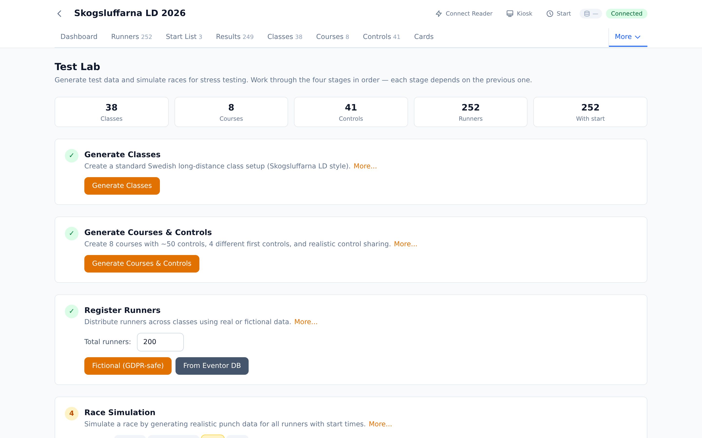

### i18n

All UI strings flow through `react-i18next` with per-page translation files. English and Swedish ship today; adding a language is a matter of copying `packages/web/src/i18n/locales/sv/*.json` and translating the values.

### Architecture

A single-command local dev loop (`pnpm dev`) brings up a Fastify + tRPC API and a Vite + React PWA that share a single PostgreSQL 18 database (`oxygen` schema). See [architecture.md](architecture.md) for the full picture.

---

## Try it

Want to run it locally? The [demo guide](demo.md) walks through spinning up Oxygen against the committed **Demo Competition** showcase — the same anonymized dataset (derived from Vinterserien) that every screenshot on this page is captured from.

```
pnpm install
pnpm dev
pnpm docs:screenshots
```

All screenshots on this page were generated by the last command, against a seeded Demo Competition. To reproduce the exact state for manual screenshots or exploration, load it into your own PostgreSQL:

```
pnpm showcase:load
```

See [scripts/load-showcase.sh](../scripts/load-showcase.sh) for `USE_DOCKER`, `DB_NAME`, and `FORCE` options.
