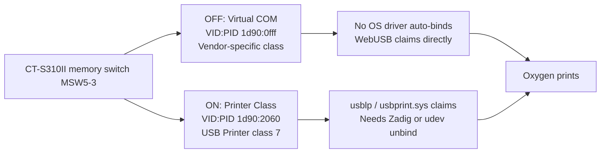
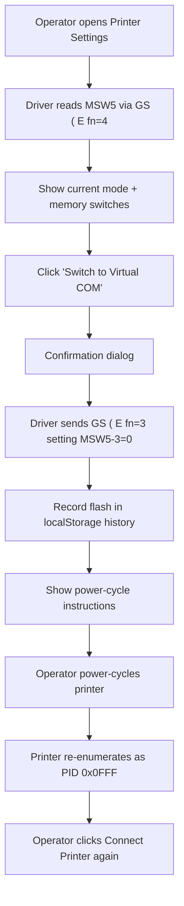

# Printer Mode Management

This document explains the *why*, *what*, and *how* of Oxygen's
in-application printer USB mode flashing. It is the design / engineering
companion to the user-facing setup instructions in
[receipt-printer-setup.md](receipt-printer-setup.md).

## Why this exists

Oxygen prints finish receipts directly from the browser via WebUSB. WebUSB
can only claim a USB interface that no kernel driver currently owns. On a
typical competition laptop running Windows with the standard CITIZEN
driver installed, the driver auto-binds to the printer and blocks WebUSB.
The historical workarounds — Zadig on Windows, a `usblp` udev unbind rule
on Linux — both require root/admin and per-laptop setup, which is
impractical when laptops are borrowed from other clubs for a single
competition weekend.

The CITIZEN CT-S310II has a memory-switch-selectable "Virtual COM" mode in
which the printer presents itself as an entirely different USB device
(different PID, vendor-specific interface class). To Windows it looks like
an unrecognised device; the CITIZEN driver doesn't bind, `usbprint.sys`
doesn't bind, `usbser.sys` doesn't bind. Chrome's WebUSB then claims the
interface directly without any fight. **Per-laptop setup becomes
unnecessary.**

The trade-off is that the printer must be configured into Virtual COM mode
once per unit. We let the operator do that from inside Oxygen via this
feature, so the only "per-printer" step is a button click rather than the
12-step on-printer FEED button procedure.

## Architecture





## Empirical findings (CT-S310II)

These were established during exploration with a real printer; they are the
ground truth that the implementation is built on.

| Finding | Evidence |
|---|---|
| MSW5-3 controls USB mode | Citizen CT-S310II User Manual, page 45 |
| MSW5-3 OFF = Virtual COM (PID 0x0FFF) | Manual page 45 + on-printer Change List slip |
| MSW5-3 ON = Printer Class (PID 0x2060) | Manual page 45 + lsusb output before flip |
| Virtual COM mode interface is `bInterfaceClass = 0xFF` (vendor-specific) | `lsusb -d 1d90:0fff -v` |
| Bulk endpoints in Virtual COM mode: `EP 0x81` IN, `EP 0x02` OUT | `lsusb -d 1d90:0fff -v` |
| No Linux kernel driver auto-binds to PID 0x0FFF | `dmesg` after replug shows no driver |
| `cdc_acm` does *not* bind (it's vendor-specific, not CDC) | Same |
| WebUSB can claim the interface directly given `uaccess` | DevTools confirmation |
| Citizen Windows driver is keyed to PID 0x2060 only | Driver INF inspection |

## Command byte reference

The CT-S310II implements the Epson `GS ( E` and `GS ( A` command families
verbatim. These commands are what the driver sends.

### `GS ( E fn 4` — Transmit memory switch setting (read)

```
GS ( E pL pH fn a
1D 28 45 02 00 04 a
```

- `a` = memory switch number, 1–10.
- Response (via bulk IN): 11 bytes.
  - `0x37` (header), `0x21` (identifier), 8 ASCII '0'/'1' bytes
    (bit 8 first, bit 1 last), `0x00` (terminator).

Implementation: `buildReadMemorySwitch` and `parseMemorySwitchResponse`
in [escpos-config.ts](../packages/web/src/lib/receipt-printer/escpos-config.ts).

### `GS ( E fn 1` and `fn 2` — User setting mode wrapper

Many older Citizen and Epson firmwares (including the 2014 CT-S310II)
silently ignore `GS ( E fn 3` unless the printer is first put into **user
setting mode** by `fn 1`, with the mode then exited by `fn 2`. Our flash
helper always wraps the write in this envelope.

```
fn 1 (enter):  1D 28 45 03 00 01 49 4E       # GS ( E pL=3, "IN"
fn 2 (exit):   1D 28 45 04 00 02 4F 55 54    # GS ( E pL=4, "OUT"
```

The printer transmits a 3-byte "mode change notice" via the IN endpoint
when entering and exiting user mode, but we don't read it (firmwares vary
on whether/when they emit it). Small sleeps (300 ms after `fn 1`, 200 ms
after `fn 3` and `fn 2`) give the firmware time to process each step.
`fn 2` typically triggers a soft reset; we still ask the operator to
power-cycle for predictability.

### `GS ( E fn 3` — Change memory switch (write)

```
GS ( E pL pH fn [a1 b18 b17 b16 b15 b14 b13 b12 b11] ...
1D 28 45 0A 00 03 a 30/31/2E (×8)
```

For setting a single switch: `pL = 0x0A` (= `9*1 + 1` per Epson spec).

- `a` = memory switch number, 1–10.
- Each `b` is `0x30` ('0' = set OFF), `0x31` ('1' = set ON), or `0x32`
  ('2' = leave unchanged). The Epson reference documents the valid range
  as `b = 48, 49, 50` — `'.'` (`0x2E`) is **not** a valid value, even
  though some third-party docs incorrectly claim it. Confirmed empirically
  via USB capture of the official Citizen POS Printer Utility writing to
  a CT-S310II.
- Bit order is MSB first: index 0 = bit 8, index 7 = bit 1.

Always use `'2'` for bits you don't want to change. This avoids racing
against any other settings that may have been altered since the last read.

Implementation: `buildWriteMemorySwitch` and `buildWriteMemorySwitchBit`
in the same file.

### Worked example — flip MSW5-3 to OFF (Virtual COM)

```
1D 28 45 0A 00 03 05 32 32 32 32 32 30 32 32
```

Breakdown:

```
1D 28 45     GS ( E
0A 00        pL pH = 10
03           fn = 3 (set)
05           a  = 5 (MSW5)
32 32 32 32 32   bits 8, 7, 6, 5, 4 — '2' (unchanged)
30           bit 3 — '0' (OFF)
32 32        bits 2, 1 — '2' (unchanged)
```

The opposite (`30` → `31`) flips MSW5-3 ON, returning to Printer Class.

Must be wrapped in `fn 1 IN` and `fn 2 OUT` to be accepted on at least
the 2014 CT-S310II firmware (see below).

### `GS ( A` — Self-test print

```
GS ( A pL pH n m
1D 28 41 02 00 00 02
```

- `n = 0` ("test print at next power-on" — but also fires immediately on
  the CT-S310II).
- `m = 2` ("rolling pattern" — also dumps memory switch values on Citizen
  models, equivalent to the slip from the FEED-button self-test).

Implementation: `buildSelfTest` in the same file.

## Memory switch table (CT-S310II, partial)

Switches that we touch or display. Full table at
[Citizen CT-S310II User Manual page 45](https://www.citizen-systems.co.jp/cms/c-s/en/printer/download/document-user-pos_mobile/CT-S310II_UM_130_EN.pdf).

| Switch | Function | OFF | ON | Notes |
|---|---|---|---|---|
| MSW5-1 | Buzzer | Valid | Invalid | |
| MSW5-2 | Line Pitch | 1/360 | 1/406 | |
| **MSW5-3** | **USB Mode** | **Virtual COM** | **Printer Class** | The bit we flash |
| MSW6-1 | Act. For Driver | Invalid | Valid | |
| MSW6-2 | Character Space | Invalid | Valid | |
| MSW6-3 | USB Power Save | Invalid | Valid | |
| MSW7   | Serial port settings + VCom Protocol | various | various | "VCom Protocol = PC Setting" is the default and what we expect |

## Borrowed-equipment workflow

Competitions frequently use printers borrowed from other clubs. Those
clubs' kiosk setups typically rely on the CITIZEN driver and expect the
printer in Printer Class mode; flipping it to Virtual COM during a
competition without flipping it back would break their next event.

The flash history module
([printer-flash-history.ts](../packages/web/src/lib/printer-flash-history.ts))
addresses this:

- Every flash is recorded in `localStorage` under
  `oxygen.printer-flash-history.v1`, keyed by `${vendorId}:${serial}`.
- The record includes `originalMode` (the mode the printer was in *before
  the first* flash), `currentMode` (the mode after the most recent flash),
  and a timestamp.
- When the operator round-trips back to `originalMode`, the record is
  removed entirely — the printer is in its "as borrowed" state and we
  shouldn't keep nagging.
- The Printer Settings dialog surfaces a yellow "Pending restore" banner
  whenever a connected printer's `currentMode != originalMode`, naming the
  mode it should be restored to.

### Key choice rationale

USB serial is *stable* across mode flips (PID changes, but the descriptor
serial does not). So we key by `${vendorId}:${serial}` rather than the
more obvious VID:PID:serial — otherwise the same printer in two different
modes would get two different records.

The CT-S310II reports a serial of `00000000` (factory default). For
single-printer setups this is fine; for fleets of identically-defaulted
printers, all units would be tracked as one. We document this limitation
rather than try to invent a stable surrogate ID — the unit owner can
configure unique serials with Citizen's own utility if it ever matters.

### Competition-end notification (deferred)

The plan originally called for a non-blocking notification at competition
close listing pending restores. The Oxygen codebase doesn't have an
obvious "competition session ended" hook (competitions stay registered in
MeOSMain across sessions). We instead surface the warning whenever the
operator opens Printer Settings; the persistent badge survives reloads and
across operators on the same kiosk because it lives in `localStorage`.

If a stronger notification is needed later, candidate insertion points are
the `RecentCards` panel close flow or a new banner in the
`CompetitionShell` header that calls `pendingRestores()` from the flash
history module.

## Recovery procedures

### "I sent the wrong flash command and the printer is in a weird state"

The on-printer FEED-button setup mode is OS-independent and survives any
software-induced misconfiguration. Follow the procedure in
[receipt-printer-setup.md → Virtual COM mode → Step 1](receipt-printer-setup.md#step-1--flip-the-printer-to-virtual-com-mode-once-per-printer)
to manually set MSW5-3 to whichever value is needed, or use Citizen's
built-in "Memory switch initialization" (Manual page 44) to reset every
switch to factory defaults.

### "Oxygen says 'Could not claim the printer USB interface'"

In Printer Class mode this means the OS printer driver beat us to the
interface. Either (a) flip the printer to Virtual COM mode and the
problem goes away on every laptop forever, or (b) follow the legacy
Printer Class setup in `receipt-printer-setup.md` to free the interface.

### "I flashed to Virtual COM but the printer didn't re-enumerate"

The `GS ( E fn=3` command writes to NVRAM but the change only takes effect
at USB re-enumeration. Power-cycle the printer (turn off, wait two
seconds, turn on). The PID will change from `0x2060` to `0x0FFF` (verify
with `lsusb` on Linux or Device Manager on Windows).

## File layout

| File | Purpose |
|---|---|
| [escpos-config.ts](../packages/web/src/lib/receipt-printer/escpos-config.ts) | Pure byte construction for `GS ( E` / `GS ( A`. Unit tested. |
| [drivers/webusb.ts](../packages/web/src/lib/receipt-printer/drivers/webusb.ts) | WebUSB driver. Speaks both Printer Class (PID 0x2060) and Virtual COM (PID 0x0FFF). Exposes `readMemorySwitch`, `flashUsbMode`, `printSelfTest`, etc. |
| [printer-flash-history.ts](../packages/web/src/lib/printer-flash-history.ts) | localStorage persistence of flash records. Pure module, unit tested. |
| [PrinterContext.tsx](../packages/web/src/context/PrinterContext.tsx) | React context wrapping the driver; exposes the new methods to UI components. |
| [PrinterSettingsDialog.tsx](../packages/web/src/components/PrinterSettingsDialog.tsx) | The modal UI. |
| [CompetitionShell.tsx](../packages/web/src/pages/CompetitionShell.tsx) | Hosts the dialog and the launcher button in the More menu. |
| [receipt-printer-setup.md](receipt-printer-setup.md) | User-facing setup guide. |

## Limitations / future work

- **Self-test print disconnects the printer.** Empirically, sending
  `GS ( A` to a CT-S310II makes the printer drop its USB connection
  during the long test print. The slip prints fine, but the WebUSB
  connection is lost and must be re-established with a fresh
  `Connect Printer` click after the print finishes. This appears to be
  printer firmware behaviour (the test mode resets the USB stack); we
  surface the warning in the dialog and otherwise leave it alone.
- **Memory switch reads need multi-packet accumulation.** When the
  `GS ( E fn=4` read command *is* supported, responses arrive as USB
  short packets that may be split (e.g. 5+6 bytes). The driver's
  `readBytes` accepts an `atLeast` option to loop until the target byte
  count is reached; `readMemorySwitch` uses `atLeast: 11`.
- **`GS ( E fn=4` reads behave differently in the two USB modes** on at
  least the 2014 CT-S310II firmware (BOT-001.017):
  - In **Printer Class mode** (PID `0x2060`) reads work correctly with
    the documented Epson framing — verified via USB capture of the
    official Citizen POS Printer Utility, which is itself only able to
    talk to the printer in Printer Class mode (Windows printer driver
    path).
  - In **Virtual COM mode** (PID `0x0FFF`) the IN endpoint streams a
    repeating `0x31 0x60` background-status pattern indefinitely and the
    documented `0x37 0x21` response never appears. The driver retries up
    to 16 short-packet reads scanning for the header, then gives up.
  - Writes (`fn=3` set memory switch) work fine in **both** modes when
    wrapped in `fn=1` IN / `fn=2` OUT.
  - The dialog therefore: determines current mode from the USB
    descriptor's PID (always reliable); shows a Virtual-COM-specific
    note explaining the read flakiness; and recommends the printer's
    own self-test print as the authoritative settings dump.
  - Citizen does not publish public firmware updates for the CT-S310II.
- **Other Citizen models**: only the CT-S310II is verified. Other models
  may put USB mode in a different memory switch or use a different bit
  encoding. The `getIdentity().ctS310IIMode` field returns `null` for any
  unknown printer, and the dialog gracefully shows
  "Printer configuration is not supported" in that case.
- **Empirical byte verification**: the implementation is built on Epson's
  `GS ( E` framing (which Citizen documents that they follow). At the time
  of writing, this has not been verified end-to-end against the physical
  CT-S310II — the very first hardware test will read MSW5 via the new
  driver and compare against the slip we already have. If anything is
  off, the framing is the suspect, not the bit positions.
- **Flash history per-serial collisions**: see "Key choice rationale"
  above. Mostly a non-issue for typical single-printer setups.
- **No automated hardware testing**: both phases lean on manual smoke
  tests. The mock-WebUSB Playwright test in
  [printer-settings.spec.ts](../e2e/printer-settings.spec.ts) verifies the
  UI flow and that the right command bytes are emitted; correctness of
  the bytes themselves is verified via the unit tests in
  [escpos-config.test.ts](../packages/web/src/lib/__tests__/escpos-config.test.ts).
